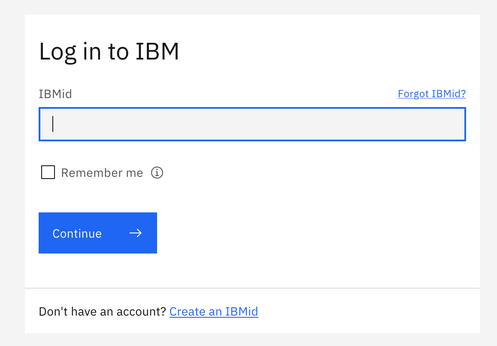
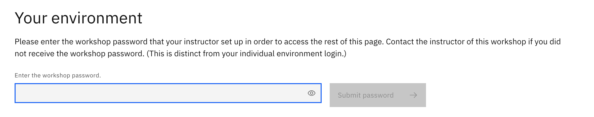

# Lab Assignments

## Connecting to your RHEL Virtual Desktop

1. **Connect to the Workshop page** at: <https://techzone.ibm.com/my/workshops/student/7e7dbc5b5d49d29401150c592abcbdab>

    :warning: **If you cannot access this page, please message an instructor and they will send you a direct link to a Virtual Machine** :warning:

1. **Log in with your IBM ID**.

    This will provide you with a link to your workshop environment.

    

1. **Under "Your Environment, enter the workshop password**: `p@ssw0rd`

    

1. **Click the link to your personal virtual machine** and **enter the password provided on the page**.

    

1. **Click the box for the RHEL desktop** that should be green and running.

    

1. **Log into the RHEL desktop** with the password: `p@ssw0rd`.

    

    !!! Note ":warning: Important :warning:"
        Each virtual machine has a 3 hour inactivity timer. If you exceed this timeout, you can restart the virtual machine, but this will log you off of the VPN. If this happens, reach out to an instructor and they will log back into the VPN for you.

## Connection Information for OpenShift Environment

:warning: The table below is only to be used for logging into OpenShift, not the RHEL virtual machine. :warning:

???+ Information "OpenShift credentials"
    | Name 	| User Number 	| OpenShift Username 	| OpenShift Password 	|
    |---	|---	|---	|---	|
    | Baillargeon 	| 01 	| user01 	| p@ssw0rd 	|
    | Barnett 	| 02 	| user02 	| p@ssw0rd 	|
    | Bewley 	| 03 	| user03 	| p@ssw0rd 	|
    | De Oliveira 	| 04 	| user04 	| p@ssw0rd 	|
    | Desmukes 	| 05 	| user05 	| p@ssw0rd 	|
    | Douglas 	| 06 	| user06 	| p@ssw0rd 	|
    | Ference 	| 07 	| user07 	| p@ssw0rd 	|
    | Gatela 	| 08 	| user08 	| p@ssw0rd 	|
    | Gatti 	| 09 	| user09 	| p@ssw0rd 	|
    | Genna 	| 10 	| user10 	| p@ssw0rd 	|
    | Hall 	| 11 	| user11 	| p@ssw0rd 	|
    | Hallur 	| 12 	| user12 	| p@ssw0rd 	|
    | Kommareddy 	| 13 	| user13 	| p@ssw0rd 	|
    | Kumar 	| 14 	| user14 	| p@ssw0rd 	|
    | Mascio 	| 15 	| user15 	| p@ssw0rd 	|
    | Natarajan 	| 16 	| user16 	| p@ssw0rd 	|
    | Olsen 	| 17 	| user17 	| p@ssw0rd 	|
    | Paul 	| 18 	| user18 	| p@ssw0rd 	|
    | Perl 	| 19 	| user19 	| p@ssw0rd 	|
    | Peterson 	| 20 	| user20 	| p@ssw0rd 	|
    | Puttalingaiah 	| 21 	| user21 	| p@ssw0rd 	|
    | Sarvodaya 	| 22 	| user22 	| p@ssw0rd 	|
    | Sepp 	| 23 	| user23 	| p@ssw0rd 	|
    | Stramer 	| 24 	| user24 	| p@ssw0rd 	|
    | Tibbetts 	| 25 	| user25 	| p@ssw0rd 	|
    | Vandale 	| 26 	| user26 	| p@ssw0rd 	|
    | Ziegler 	| 27 	| user27 	| p@ssw0rd 	|
    |  	| 28 	| user28 	| p@ssw0rd 	|
    |  	| 29 	| user29 	| p@ssw0rd 	|
    |  	| 30 	| user30 	| p@ssw0rd 	|