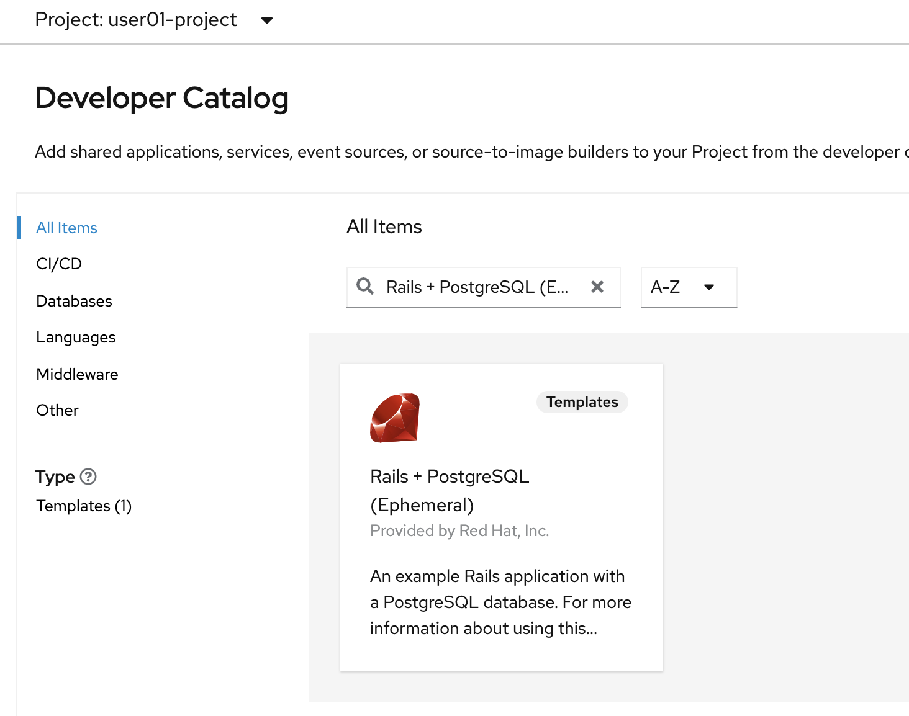
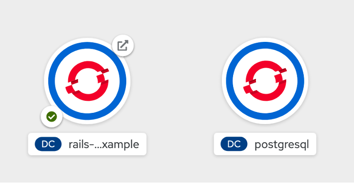
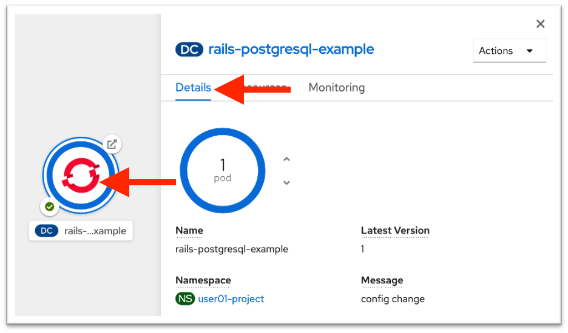
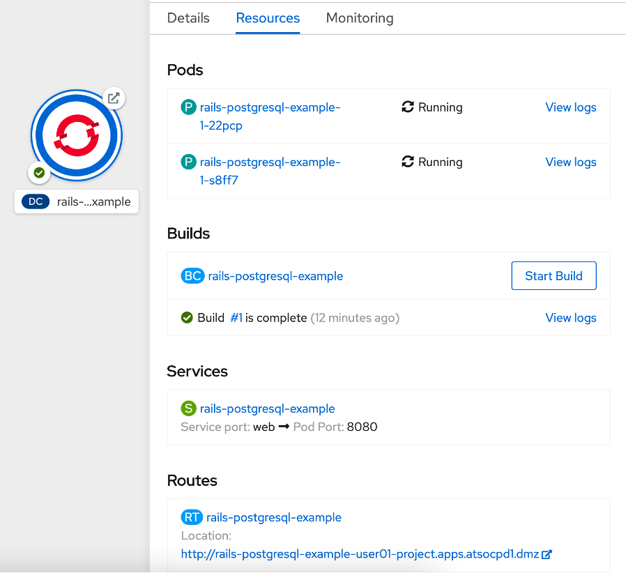
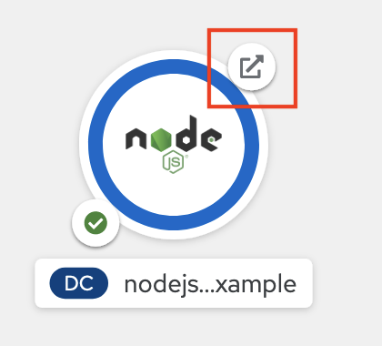
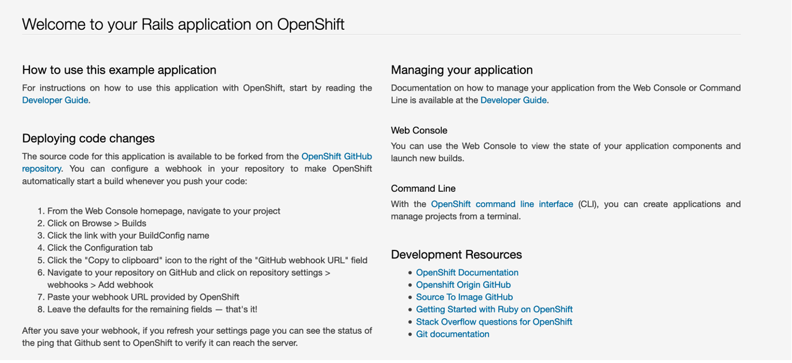

# Deploy from the Developer Catalog

In this section, you will be building a sample application from a template. The template will create two pods:

* A Ruby on Rails blogging application from source code in GitHub

* A PostgreSQL database from a container image

???+ Info
    A *container image* holds a set of software that is ready to run, while a *container* is a running instance of a container image. Images can be hosted in registries, such as the OpenShift internal registry, the Red Hat registry, Docker Hub, or a private registry of your own.

1. **Click the From Catalog option** from the Add page.

    This brings up the OpenShift Developer catalog containing all types of applications you can deploy including Operators, Helm Charts, Templates, and more.

1. **Find and click the Rails + PostgreSQL (Ephemeral) tile**.

    !!! Tip
        You can search for *Rails + PostgreSQL (Ephemeral*) in the search bar.

    

1. **Click Instantiate Template** on the next screen that appears.

    You are brought to a page full of configurable parameters that you can edit if so desired. Notice that all of the required fields on this page automatically populate. You can read through all of the options, but there is no need to edit any of them.

1. **Click the Create button** at the bottom of the page.

    You will now be taken to the topology view, where you will see two icons – one for each of the two workload pods that the template will create. If you don’t see the icons right away, you may need to refresh your browser window.

    ???+ Info
        The Ruby on Rails application will take a few minutes to fully deploy, while the PostgreSQL application will deploy in just a few seconds. The reason for this difference is that the Ruby application is being built (containerized) from Ruby source code located in the GitHub repository located here: <https://github.com/sclorg/rails-ex.git> into a container image, and then deployed. If you would like to watch the steps that OpenShift is taking to build the containerized application, **click the circle labeled rails-postgresql-example, click the Resources tab, and click View Logs in the Builds section**.

        The PostgreSQL application, on the other hand, is deployed from a pre-built container image hosted in quay.io, so it takes much less time to start up.

    You will know that both applications are successfully deployed and running when each icon has a solid blue circle.

    

1. **Click the icon for the rails-postgresql-example application**. This will bring up a window on the right side of the screen with information about your DeploymentConfig.

1. **Click the Details tab** if it is not already selected.

    

    Here you’ll see information about your DeploymentConfig. Notice that many of the fields such as Labels, Update Strategy, and more have been populated with default values. These can be modified.

1. **Click the Actions dropdown**.

    

    Many application configurations can be modified from this menu, along with other tasks such as starting or pausing a rollout, or deleting the deployment configuration.

1. **Click the up arrow** next to the blue circle.

    

    This scales your application from one pod to two pods.

    

    ???+ Note
        This is a simple demonstration of horizontal scaling with Kubernetes. You now have two instances of your pod running in the OpenShift cluster. Traffic to the Rails application will now be distributed to each pod, and if for some reason a pod is lost, that traffic will be redistributed to the remaining pods until a Kubernetes starts another. If a whole compute node is lost, Kubernetes will move the pods to different compute nodes.

        OpenShift and Kubernetes also support autoscaling of pods based on CPU or memory consumption, but that is outside the scope of this lab.  

1. **Click the Resources tab**.

    

    Notice the two pods associated with your Rails application. On this page, you’ll see more information about your pods, any build configurations currently running or completed, and the services/ports associated with the pod.

1. **Click the route address a the bottom of the resources tab**.

    ??? "Expand for a Tip"
        You could also access this route by clicking on the external link icon associated with your Rails pod on the Topology view.

        

    

    If you see the page above, your Rails application is up and running. You just deployed a Ruby on Rails application from source code residing in GitHub, and connected it to a PostgreSQL container deployed from a container image pulled from quay.io into OpenShift running on an IBM Z server.

    Feel free to read through the Rails application homepage to learn more about what this application can do.

1. **Add `/articles` to the end of the Rails homepage URL**.

    This will result in a URL like the following:

    <http://rails-postgresql-example-userNN-project.apps.atsocppa.dmz/articles>

    Where `NN` is your user number.

    

    You are now interacting with the blogging application that’s shipped with the Rails source code. If you create a new article, the contents for the Title and Body are stored in the PostgreSQL database in the other pod that makes up this application.

    In the next section you will navigate back to the Administrator perspective to see the overview of your project with a workload running.
