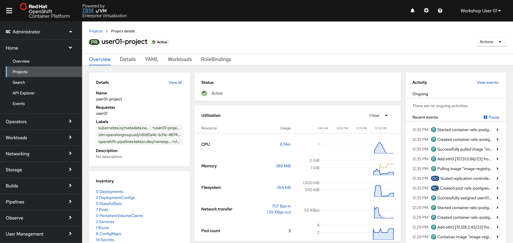
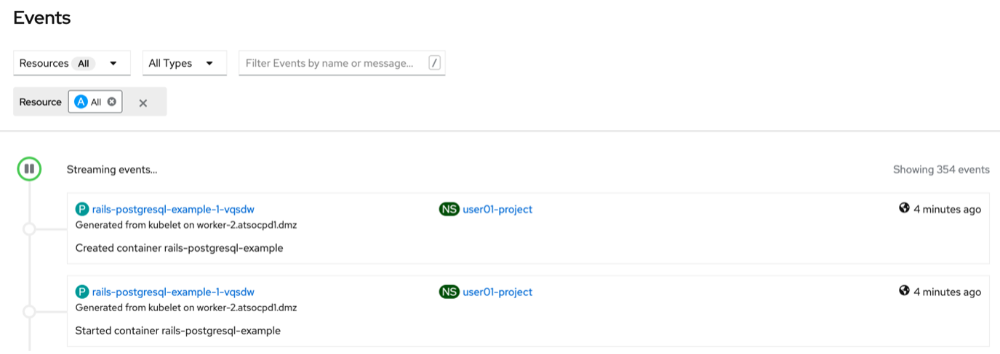

# View Workload from the Administrator Perspective

!!! Important
    Work in Progress

1. In the left-side menu, **select the Administrator perspective**.

    

1. **Navigate back to your project by clicking Menu -> Home -> Projects -> userNN-project**

    The overview page now displays data about the CPU and Memory Usage, new objects in your project inventory, and new activity in the events panel.

    

1. Click View Events under the right-side panel.

    

    This page is populated with all of the events associated with your project, including errors, container creation messages, pod scaling and deletion, and much more. You can filter by type, category, or by searching for keywords.

    !!! Note
        Feel free to click through a few more pages from the left-side main menu. You’ll notice a few of them have objects created as a part of the Rails-PostgreSQL application, such as Workloads  Pods, Networking  Services and Routes, Builds  Image Streams. These were all created as part of the template package.

1. *Navigate back your project* as in the previous step (or by clicking your browser’s back button).

1. Find the Inventory on the project page which lists all of the objects created as part of your application
