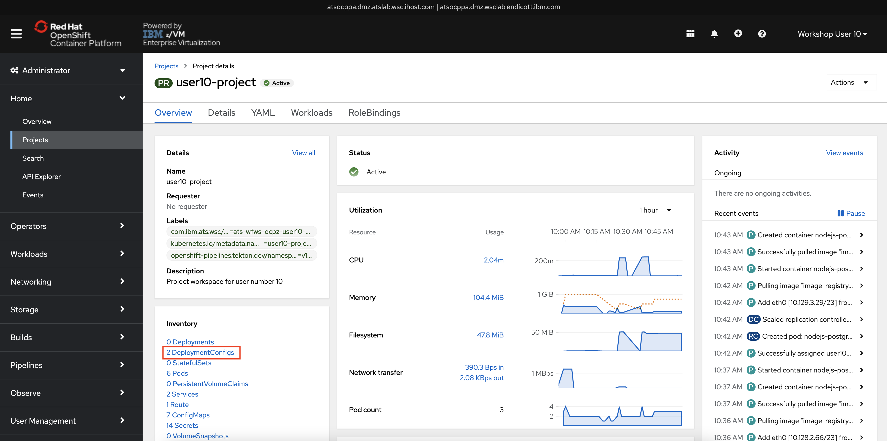
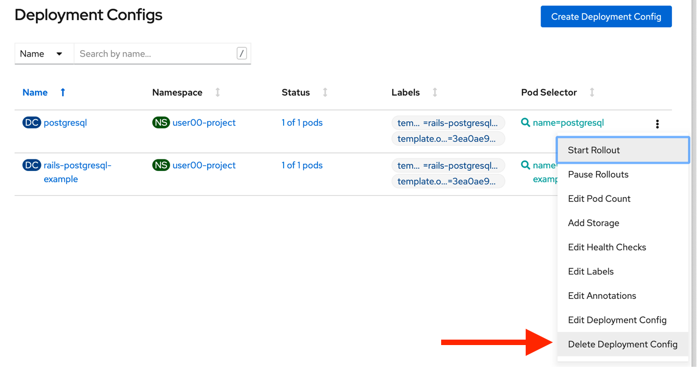

# Cleaning Up

1. **Navigate back your project** as in the previous section (or by clicking your browser’s back button).

1. **Find the Inventory on the project page** which lists all of the objects created as part of your application

1. **Click the Deployment Configs hyperlink**.

    

1. For both of the 2 Deployment Configs that appear **click the three dots on the right side of the screen, and then click Delete Deployment Config.**

    

    This will delete some, but not all of the resources created by the application template. The running pods will be stopped and deleted, but some other components will remain. This is not a problem in the case of these labs.
