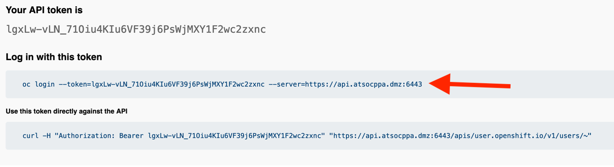

# Log into OpenShift Using the CLI

In this section, you will be connecting to a “Linux Guest” server which has a few things set up to make your life a little easier. Most notably, it has the OpenShift command line `oc` installed, so you don’t have to install it on your RHEL VM terminal.

1. **Open a Terminal session**

1. **ssh into the Linux Guest server: `ssh userNN@192.168.176.61`** (where NN is your user number).

1. When prompted, **enter your password: `p@ssw0rd` and hit enter**.

    ???+ example "Example Output"
        

1. In Firefox, **navigate to the following URL** to request an API token:

    <https://oauth-openshift.apps.atsocpd2.dmz/oauth/token/request>

1. **Enter your OpenShift credentials when prompted**.

    * Username: userNN

    * Password: p@ssw0rd

1. **Click the “Display Token” hyperlink**.

    

1. **Copy the contents of the first text box** beginning with “oc login” and ending with “6443”.

    

1. **Paste this command back in your terminal session and press enter**.

    ```bash
    oc login --token=<YOUR_TOKEN_HERE> --server=https://api.atsocpd2.dmz:6443
    ```

    !!! Important
        If you’re prompted to use an insecure connection, type Y and hit enter.

    ???+ example "Example Output"

        ```
        user01@lab061:~$ oc login --token=uL3fHEPSGH3io0htdGRfAMAPIIY44BhwnGxCMA3dei4 --server=https://api.atsocpd2.dmz:6443
        Logged into "https://api.atsocpd2.dmz:6443" as "user01" using the token provided.

        You have access to 161 projects, the list has been suppressed. You can list all projects with 'oc projects'

        Using project "user01-project".
        ```

    You are now logged into the cluster via the command line, and you are told which project you are using.

    If you’re in a project other than userNN-project, use the following command to move into it: `oc project userNN-project`, where NN is your user number.
