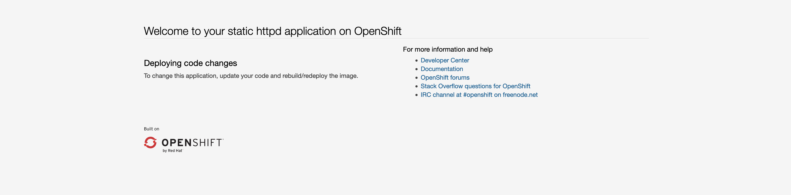

# Access the httpd Server in a Browser

## Background 

As you saw in the [previous section](lab002-4.md), OpenShift deployed other Kubernetes objects along with pods when you ran the `oc new-app` command. Two of these objects - *services* and *routes* - provide access into the running pods from both inside and outside of the cluster. 

Because pods are designed to rapidly start, stop, move, and scale, and the fact that pods each have their own IP address, you can't rely on IP addresses to access running applications like you typically can for non-containerized workloads. Therefore we need another way to reliably access the application pods, and this is what services and routes provide.

[Services](https://kubernetes.io/docs/concepts/services-networking/service/) are essentially load balancers internal to the OpenShift cluster. Whenever a request is made to a service, it is then directed to a pod based on [label matching](https://kubernetes.io/docs/concepts/overview/working-with-objects/labels/). Unlike pod IP addresses, services are static and do not change over time. However, services are only internal to the cluster and do not provide access from external users. 

[Routes](https://docs.openshift.com/container-platform/4.10/rest_api/network_apis/route-route-openshift-io-v1.html), on the other hand, expose services to the outside world. Routes provide *ingress* to the cluster and are they way that end users applications running in pods.

## Accessing the httpd Server

1. **In the OpenShift CLI, find the route in your `userNN-project`**. 

    ```text
    oc get route
    ```
        
    ???+ example "Example Output"
        ```text
        NAME            HOST/PORT                                        PATH   SERVICES        PORT    TERMINATION   WILDCARD
        httpd-example   httpd-example-user00-project.apps.atsocppa.dmz          httpd-example   <all>                 None
        ```

    From this output, you see that you have a route named `httpd-example`, it has an automatically generated hostname (that can be changed if you wish), and you see that it references a service named `httpd-example`. The port for this service/route is not shown because it is the default for HTTP web services, `8080`. 

1. **Navigate to this route in a web browser, but make sure you add `http://` to the beginning**.

    For example, userNN's URL would be: <http://httpd-example-userNN-project.apps.atsocppa.dmz>.

    

    Your request to the `httpd-example` route was passed to the `httpd-example` service which uses labels to point to the `httpd-example-1-XXXXX` pod. If this pod is recreated with a new IP address, you as the end user will not notice any difference or need to connect through any other method, the route will still work. Similarly, if you scale the application so there are multiple pods with different IP addresses (as you will in the next section), the OpenShift load balancer will take the requests and direct them to specific pods based on your desired load-balancing algorithm (e.g. `random`, `source`, `roundrobin`, `leastconn`).
    