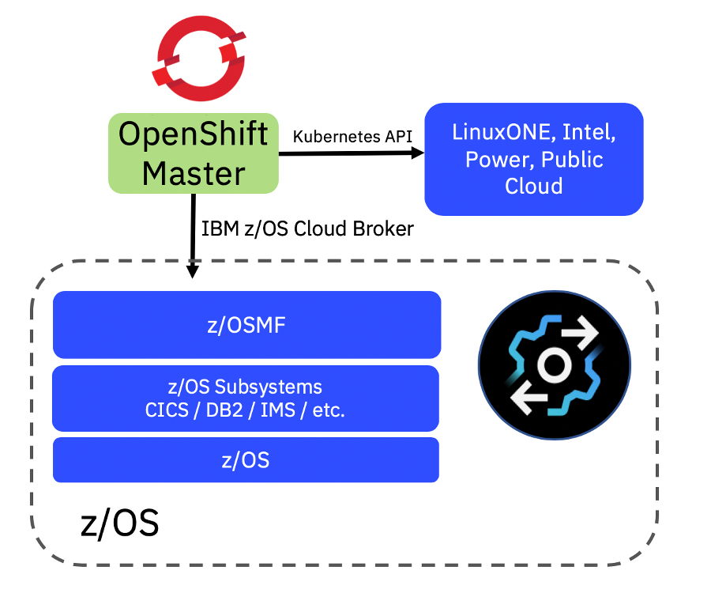

# Lab 003 - Using the z/OS Cloud Broker - Introduction

!!! Important
    Work In Progress

The *IBM z/OS Cloud Broker* is an offering that connects z/OS services running on an IBM Z backend to a frontend private cloud platform providing self-service access and consumption of these services to developers. This allows developers to provision their own z/OS resources directly from the OpenShift console – without the need for z/OS skills or direct access.

The services available for the broker to expose into OpenShift are:

| z/OS Connect EE                                                                            |     Db2                                                                                          |     CICS                                          |     IMS                                                  |     MQ                                                            |     WLP                                             |
|--------------------------------------------------------------------------------------------|--------------------------------------------------------------------------------------------------|---------------------------------------------------|----------------------------------------------------------|-------------------------------------------------------------------|-----------------------------------------------------|
|     Provision / deprovision z/OS Connect   Servers.     Start/Stop z/OS Connect Servers    |     Provision / deprovision Db2   subsystems, schemas, and databases +     snapshot / restore    |     Provision / deprovision CICS regions          |     Provision / deprovision IMS TM/DB   systems          |     Provision / deprovision MQ Queue   Manager subsystem          |     WebSphere Liberty Profile server provisioning, start/stop   server    |

In this lab, you will be provisioning a WebSphere Liberty Profile (WLP) server on z/OS using the z/OS Cloud Broker on OpenShift. 