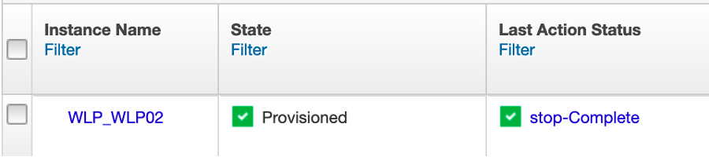
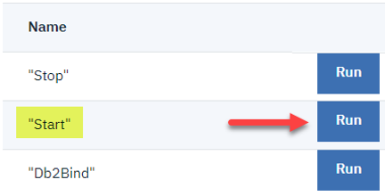
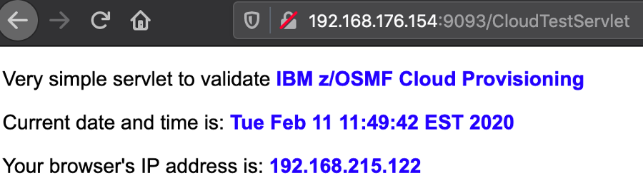

# Stop and Restart Liberty for z/OS from OCP

!!! Important
    Work In Progress

In the *Dashboard* tab, you should see the following on the left side of the screen:

1. **Click the "Run" button that's associated with "Stop"**.

1. **Click the “Action History” button above**.

    Depending on how quickly you click on this button, you’ll see either:

    

    If the stop is in progress, or:

    

    if the stop completed before you looked at the Action History.

    Over in z/OSMF, one would see:

    

1. Once you see in the Action History that the stop has completed, **go back to the tab where the timestamp application was** (`192.168.176.154:9XXX`, if you accidentally closed it).

1. **Reload this page**.

    You will see the following:

    

    (Or whatever your flavor of browser indicates when a server is no longer listening.)

1. **Go back to the Dashboard tab and click the “Run” button that’s associated with “Start”**.

    

    This will trigger a workflow over in z/OSMF to start the server.

1. **Click “Action History” and refresh until you see that the Start workflow is complete**.

    

1. **Go back to the tab with the timestamp application and reload the page**.

    You should see the time and date with the current time shown:

    

    This indicates that the server is back up and serving pages

