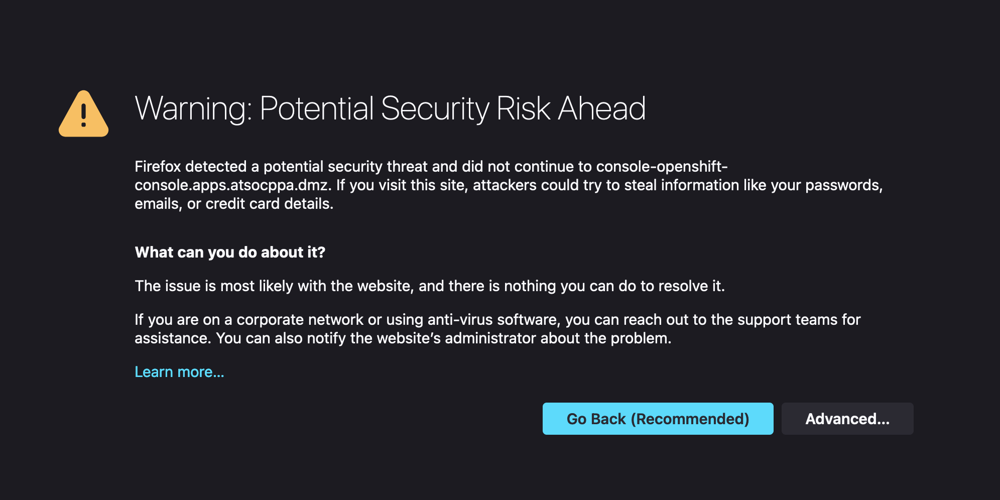
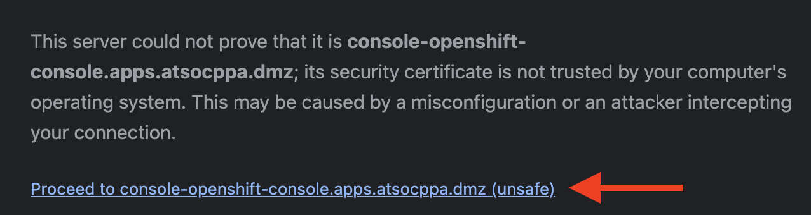

# Connect to OpenShift and Authenticate

1. In your virtual machine desktop, **open a Firefox web browser**.

1. In the browser, **navigate to the OpenShift on IBM Z console** at the following address: <https://console-openshift-console.apps.atsocpd1.dmz/>.

    !!! Important ":warning: Important :warning:"
        ***This is a different OpenShift cluster than the one used in other labs***. Make sure you follow this correct link (atsocpd1) or you will not be able to find the z/OS Cloud Broker.

    ???+ Note
        You will receive a security challenge if the cluster has not yet been accessed from your browser. This is due to the default SSL certificate being “self-signed” and not yet recognized.

        Accept the challenge to continue by **clicking Advanced** and then **clicking Proceed to console-openshift-console.apps.atsocppa.dmz (unsafe)**.

        You will likely need to do this twice due to how OpenShift reroutes Oauth requests. 

    ??? "Expand for screenshot"
        
        

    You will now see the OpenShift console login page.

    

1. **Log in with the OpenShift credentials provided to you** on the [Lab Assignments](../lab-assignments.md) page.

    !!! Hint
        Your OpenShift credentials will be something like the following:

        * Username: userNN (where NN is your user number)

        * Password: p@ssw0rd
