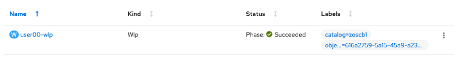
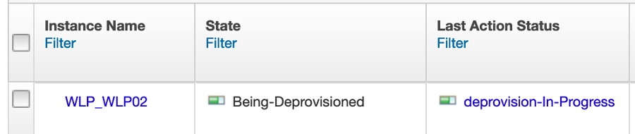
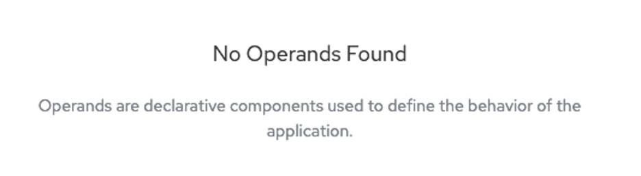

# Cleaning Up

1. **Close the tab with the timestamp application**.

1. **Close the Dashboard tab**.

1. **Navigate back to your userNN-wlp instance**

    ???+ Hint
        Administrator -> Operators -> Installed Operators -> Liberty for z/OS -> Liberty for z/OS tab

1. **Click the three dots to the far right of your provisioned service and click Delete WLP**.

    

    Over in z/OSMF, that will trigger a de-provision operation:

    

When the operation is complete, you will see

On z/OSMF, the Liberty z/OS server instance has been de-provisioned, which means it was stopped and the file system location for the server instance removed.
