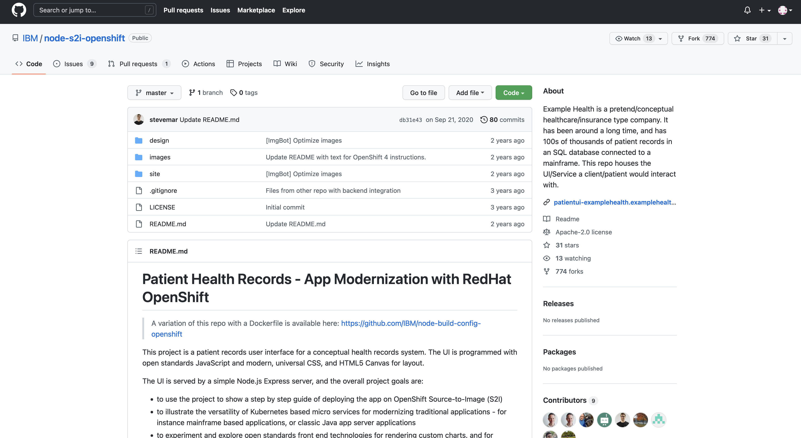
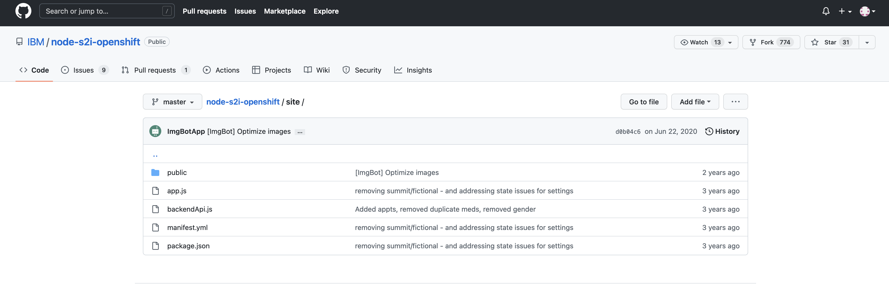
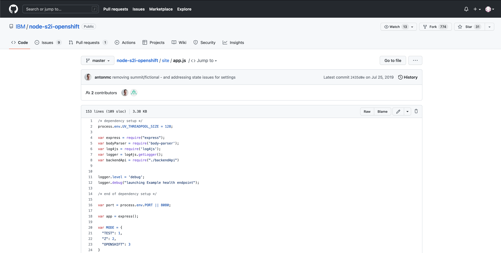
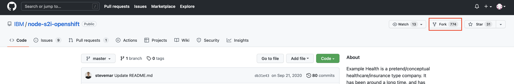

# Exploring GitHub and the Example Health Source Code

!!! Important
    Work In Progress

In this lab, you will be deploying a sample healthcare application called *Example Health*. The application is written in JavaScript, and it’s loaded into IBM’s GitHub repository.

1. In Firefox, **navigate to <https://github.com/IBM/node-s2i-openshift>**

    

    This is an IBM repository that contains everything you need in order to deploy the application – including a README file with information and instructions, additional files required for the source code to work, and the source code itself. Let’s look at the source code now.

1. **Open the site folder**.

    

1. **Open the app.js file**.

    

    This is the source code for the frontend application that OpenShift will build into a container. Notice that it is NOT any sort of container image, Dockerfile, or YAML file itself – rather, it is *written in Javascript*. Feel free to look through the code.

1. **Click on the node-s2i-openshift hyperlink** to get back to the main repository page.

    Your URL should again be <https://github.com/IBM/node-s2i-openshift>

    You’ll need to make a fork of this repository so you have your own copy to work with. To do so, you’ll need to sign into GitHub.

1. **Click the Sign In button in the top right**.

    

1. **Log in with YOUR OWN GitHub credentials**.

    ???+ Note
        If you don’t have a GitHub account already, please create one and then sign in with it.

    After a successful login, you will be taken back to the main repository page. Now you can create your own fork of the repository.

1. **Click the Fork button on the left side of the page**.

    

    When complete, you will be taken to your forked repository page

    Notice that while everything else looks basically  the same, the URL has changed from <https://github.com/IBM/node-s2i-openshift>

    to:

    <https://github.com/YOUR_GITHUB_USERNAME/node-s2i-openshift>

1. Leave this browser tab open, and open another.
