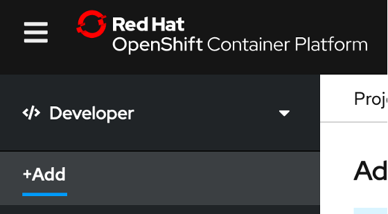
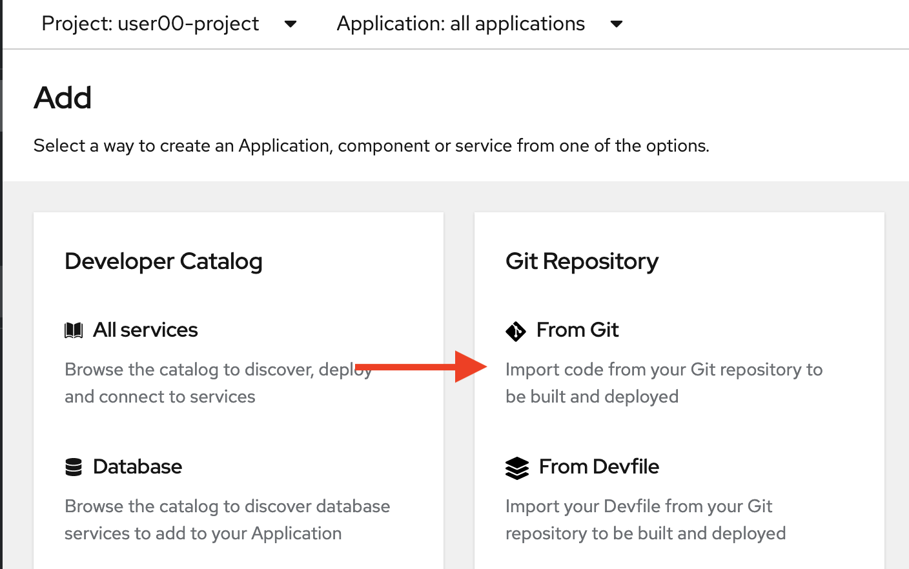
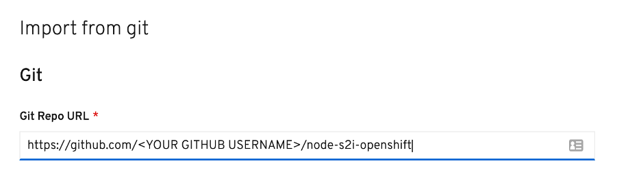
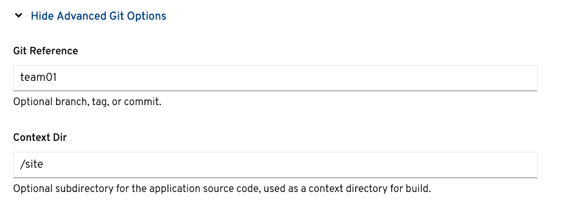
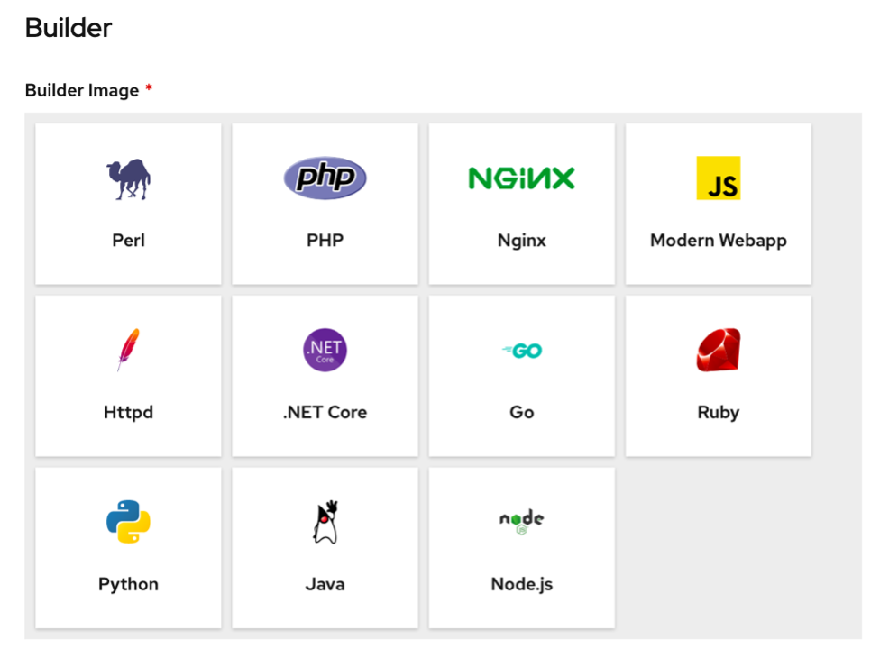
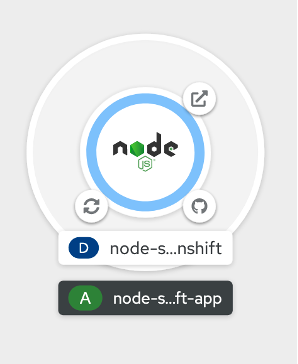
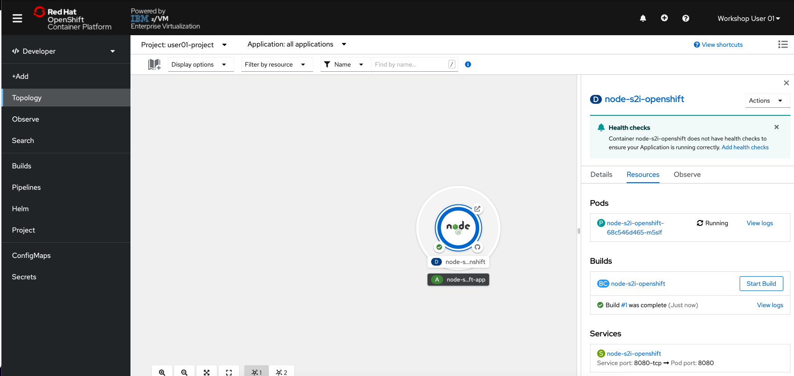
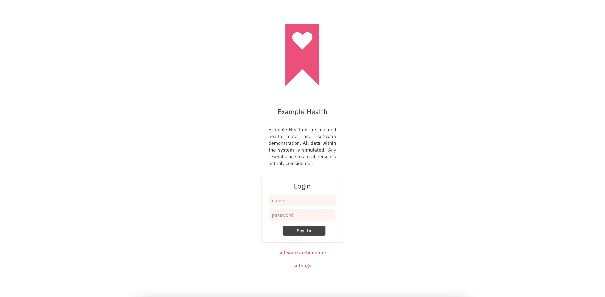
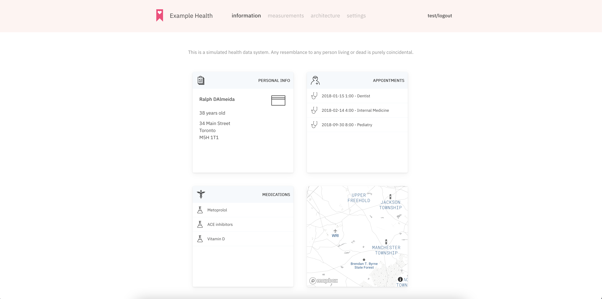

# Edit the Source Code and Push an Update

1. **Switch to the Developer Perspective**, if not already on it.

    

1. **Change into your userNN-project** if not already in it.

    

1. **Click the +Add button from the left-side menu**.

    

1. **Click the From Git tile**.

    

1. **In the Git Repo URL field, enter the URL of your forked repository**.

    It will look something like: <https://github.com/YOUR_GITHUB_USERNAME/node-s2i-openshift>

    

1. **Click the Show Advanced Git Options hyperlink**.

1. **In the Context Dir field, enter `/site`**.

    

    ???+ Note "Recall"
        This is the folder in the GitHub repository that you dug into to view the source code.

1. **For Builder Image, select the Node.js tile**.

    

1. **Scroll to the bottom of this page and click the Create button**.

    You will be taken to the Topology page, which will show your new application along with three smaller circular buttons that can be used to perform different actions against the application.

1. **Click the circular Node.js application icon**.

    

    At first, the icon will be all white and you will see “Build #1 is running” in the righthand panel. If you wish, you can watch the logs for the running Build to see everything it’s doing. After a minute or two, the icon will have a green check mark next to it, indicating the Build is complete. Once the Build is complete, your Pod will be created. You can also watch the logs for this, if you wish. About 10 seconds later, a solid blue ring will appear around the edge of the circular icon, indicating that the pod is up and running.

    

    ???+ Note
        Feel free to click on the *View Logs* hyperlink to watch everything that the build is creating. When complete, the log will display `Push Successful`, and you can return to the Topology page by clicking the link on the left side of the page.

    If you clicked off of the Node.js application Resources tab, click on the circular icon again, then click on the Resources tab.

1. **Click the Route URL** – beginning with http://

    

    You will be taken to the Example Health application.

    

1. **Log into the Example Health application using the following credentials**:
    * Username: `test`
    * Password: `test`

    

    All of the data in this application is simulated to look similar to the health records of an insurance company. Feel free to explore the application and notice the multiple tabs it contains.

    The JavaScript code you looked at in your forked GitHub repository was containerized by OpenShift’s S2I function and deployed onto the OpenShift cluster.

    Now that your application is running in a container in OpenShift, let’s see how an application developer can make a change to the source code, and then push the update to the running application.

    We’ll make a simple change in a few lines of text to demonstrate. As we see in the Example Health application, there is a section with Personal Information.

    

1. **In your forked GitHub repository, navigate to the source code again**:

1. **Make sure you are in your own fork of the repository**.

1. From <https://github.com/<YOUR_GITHUB_USERNAME>/node-s2i-openshift>, **click on the site folder**.

1. **Click on the app.js file**.

1. With the app.js file open, **click on the edit button** pointed out in the picture below.

    

1. **Scroll down to line 55**, which displays the patient name.

1. **Edit lines 55-60 as you wish, modifying the text strings for Name, Age, Gender, etc**.

    

1. **Click Commit Changes** at the bottom of the page.

You just edited the source code, but you still need to push the update to the running application.

1. **Back in the OpenShift console, navigate to the Topology page -> Click the Node.js application icon -> Click the Resources tab -> Click the Start Build button**.

    

    A new Build #2 will be created. As with the first build, you can view the build logs to watch everything it’s doing, or you can simply wait for the console to display `Build #2 is complete` and your Pod `Running`.

1. When the Pod is `running`, **refresh the Example Health browser tab**.

    

Your code changes have been pushed to the running Example Health application.
