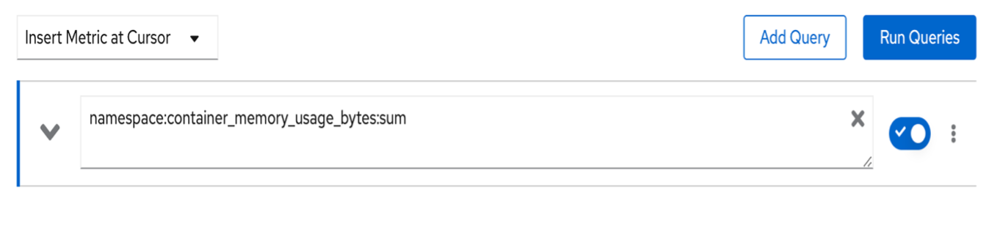

# Using OpenShifft Metrics (Prometheus)

OpenShift provides a web interface to *Prometheus*, which enables you to run Prometheus Query Language (PromQL) queries and visualize the metrics on a plot. This functionality provides an extensive overview of the cluster state and helps to troubleshoot problems.

1. In the OpenShift console, **switch to the Administrator perspective** if you are not already on it.

    

1. In the menu bar on the left side of the page, **click Monitoring and then Metrics**.

    

    You will be taken to a Prometheus interface within the OpenShift console.

    

    Once you enter a query, the graph will populate.

1. **Click the Insert Metric at Cursor dropdown and enter the following string in the new query bar**:

    ```text
    namespace:container_memory_usage_bytes:sum
    ```

    

1. **Click the associated query result that is returned**.

    

    The string will populate the query text box.

1. **Click the blue "Run Queries" button**.

    

    The graph should now display the memory usage over time for each namespace.

1. **Scroll down the page** to the table displaying each namespace and its memory usage in bytes.

    

    ???+ Note
        You table will look different depending on what work is being done in the OpenShift cluster at the time.

    OpenShift passes around a massive amount of data to run itself and the applications running on top of it. Prometheus is an extremely powerful data source that can return results for millions of time strings with extremely granular precision.

    Because of OpenShift’s vast data production and Prometheus’ ability to process it, certain queries can produce simply too much data to be useful. Because Prometheus makes use of labels, we can use these labels to filter data to make better sense of it.

1. **Modify your query to the following**:

    ```text
    namespace:container_memory_usage_bytes:sum{namespace="userNN-project"}
    ```

    !!! Important
        Make sure you change the one instance of `NN` to your user number.

        Also, notice that they are squiggly brackets `{}` in the query, not regular parentheses.

1. **Click Run Queries**

    

    Your graph is now displaying the memory usage over time for your own project. If you see a “No datapoints found” message, select a longer timeframe using the dropdown menu in the top left of the graph.

    ???+ Note
        If you skipped ahead to this lab without completing the others, it’s possible that your project has not had workload deployed in it for more than the maximum time frame. If this is the case, run a simple application in your project, and you will see the data start to populate (refer to Lab 001 – Exploring the OpenShift Console for help with this.)

As you might have noticed, working directly with Prometheus can be tedious and requires specific PromQL queries that aren’t the easiest to work with. That’s why people typically use Prometheus for its *data source* functionality, and then move to Grafana for the *data visualization*.
