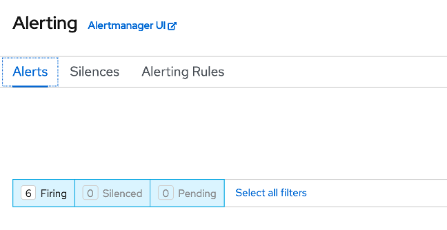

# Using OpenShift Alerts with Alertmanager

Alerting with Prometheus is separated into two parts. Alerting rules in *Prometheus* send alerts to *Alertmanager*. Alertmanager then manages those alerts, including silencing, inhibition, aggregation and sending out notifications via methods such as email or chat platforms like Slack.


An example rules file with an alert would be:

```yaml
groups:
- name: example
  rules:
  - alert: HighRequestLatency
    expr: job:request_latency_seconds:mean5m{job="myjob"} > 0.5
    for: 10m
    labels:
      severity: page
    annotations:
      summary: High request latency
```

The optional `for` clause causes Prometheus to wait for a certain duration between first encountering a new expression output vector element and counting an alert as firing for this element. In this case, Prometheus will check that the alert continues to be active during each evaluation for 10 minutes before firing the alert. Elements that are active, but not firing yet, are in the pending state.

The `labels` clause allows specifying a set of additional labels to be attached to the alert. Any existing conflicting labels will be overwritten.

The `annotations` clause specifies a set of informational labels that can be used to store longer additional information such as alert descriptions or runbook links.

1. In the menu bar on the left side of the OpenShift console, **click Monitoring and then Alerting**.

    You will be taken to an Alertmanager interface within the OpenShift console.

    

1. **Click the Alerting Rules tab** to see the 100+ alerts that are not currently firing (hopefully!)

    

    These alerts come pre-built with the monitoring stack, and they will start firing if triggered. This list includes alerts for critical operators going down, pods crash-looping, nodes being unreachable, and many more. Feel free to look through them.
