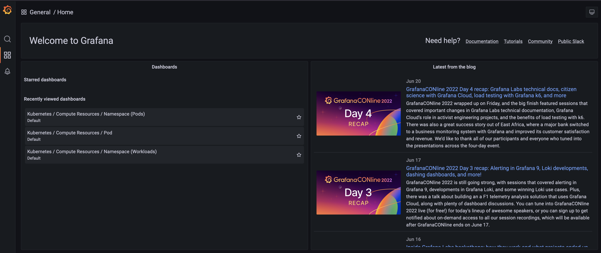
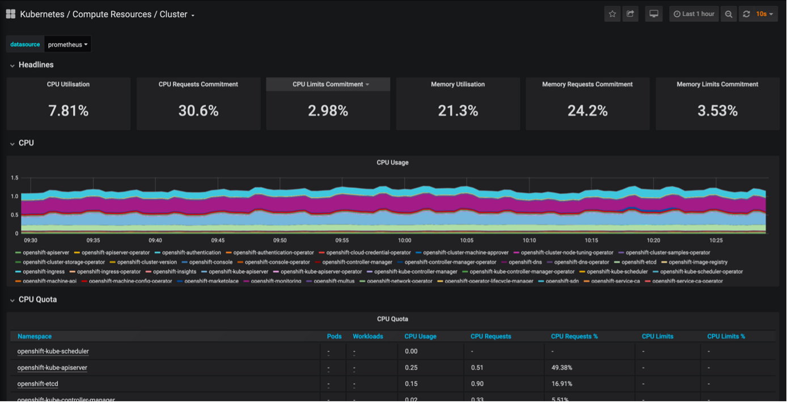
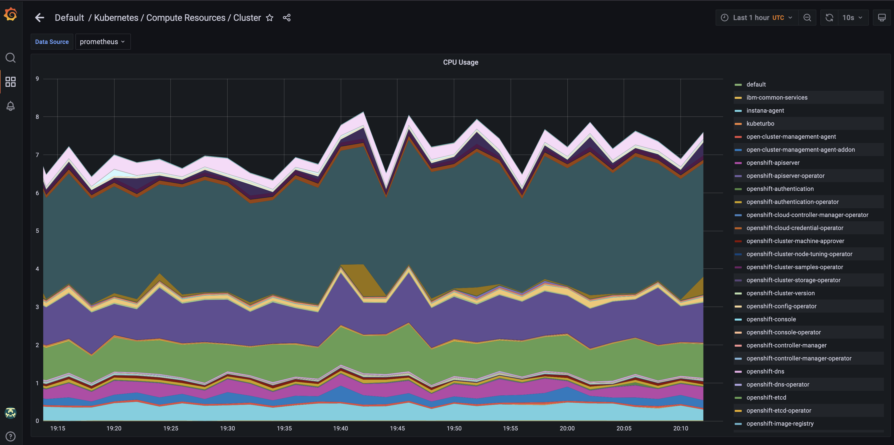
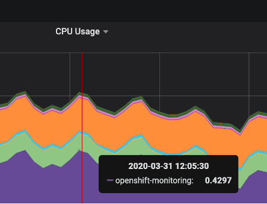
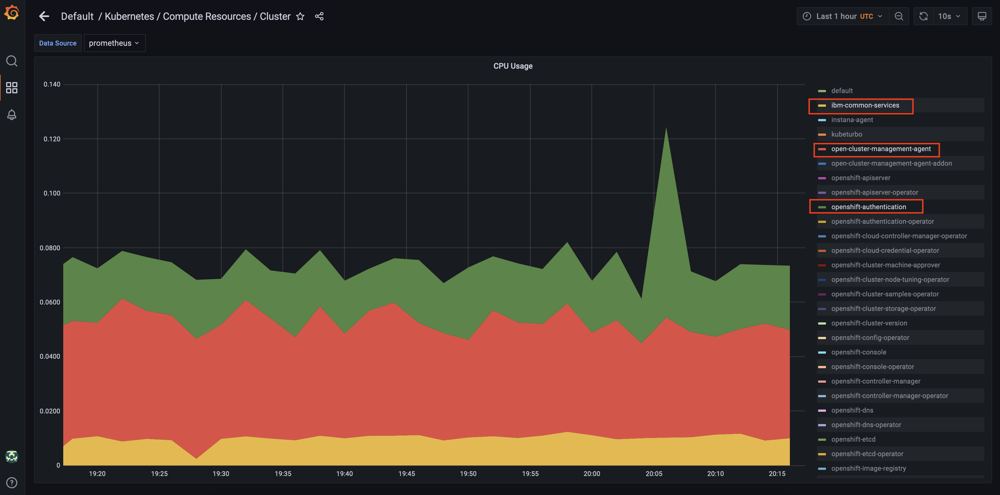

# Using Grafana Dashboards

Once logged into Grafana, you’ll be taken to the Home Dashboard from which you can navigate to your starred or recently viewed dashboards. You can also install various types of plugins from the official Grafana list and also from third-party sources from this page.

1. In the Grafana left-side menu, click the Browse option.

    

2. **Expand the Default dashboards if they aren’t already visible**.

    

    A list of the recent and pre-installed dashboards will pop up. Notice that you can search dashboards by keyword in the search bar up top, or filter by labels on the right side.

    

3. **Click the Kubernetes / Compute Resources / Cluster link**.

    

    You will see a dashboard populated with information related to the cluster’s compute resources such as CPU and memory utilization. This dashboard displays CPU usage and CPU quota/memory requests by namespace.

4. **Click the CPU Usage dropdown above the first graph in this dashboard and click View**.

    ???+ Information
        Alternatively, you can click on the CPU Usage graph to activate it, and hit the `V` key on your keyboard.

    This will bring up a full screen view of the graph to more easily see details.

    

6. **Click a random namespaces in the chart’s legend**.

    

7. **Hold the Shift key and click a few more namespaces**.

    

    This will display only the CPU usage for the few namespaces you selected.

8. **Click the Share dashboard button in the top right of the page**.

    

    From here, you can share a snapshot of the graph either internally or externally. When creating a snapshot to share externally, sensitive data will be stripped.

    ???+ Note
        If you try to share or export a graph here, you will find that it’s unsuccessful.

    The userNN profiles have administrator-viewer credentials, so you are limited to the features you can actually change. A profile with full cluster administrator authority would have more access to Grafana functions such as sharing graphs and snapshots, creating their own custom dashboards, editing and saving pre-built dashboards, and installing various plugins and other tools that extend Grafana’s built-in features.

9.  **Close this browser window when you are ready to move on**.
