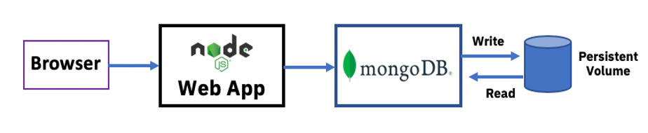

# Lab 006 - Using Persistent Storage - MongoDB and NodeJS

In production Kubernetes clusters, applications need to write data to storage where it will persist even if the application pods go down. In this lab, we’ll see how that’s done using Persistent Volumes and Persistent Volume Claims.

OpenShift on IBM Z supports various types of persistent storage, including Spectrum Scale, OpenShift Container Storage, and NFS, which is what this cluster uses. Before the start of the workshop, persistent volumes were defined in OpenShift, more than enough for one per user. Each persistent volume definition maps to the NFS server.

In this lab, you will deploy an application consisting of two components, a containerized *Node.js web application* and a containerized *MongoDB* instance, which you will back with persistent storage. Using the Node.js web application, you will be able to query the database, as well as insert new data into it.

To deploy the *Node.js application*, you will build and run the container from a Dockerfile residing in a GitHub repository.

To deploy *MongoDB*, you will pull a MongoDB image from <quay.io> and run it. The image in quay.io is the official MongoDB container image pulled from Docker Hub and moved to the Quay registry. This was done simply because Dockerhub has rate limits on pull requests from their public repository.
