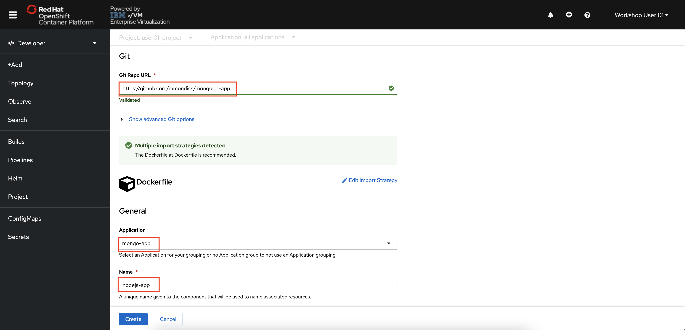

# Deploy Node.js Application from a Dockerfile

In this portion of the lab, you will deploy a Node.js web application created by the ATG. You will be building your deployment from a Dockerfile residing in a GitHub repository. Through the web application, you will be able to insert data into and query the MongoDB database you just created. For this lab the database will store sample name and email pairs displayed as a list of user information in the web UI.

First, you need to deploy the application.

1. Staying in the Developer Perspective, **click +Add from the left-side menu**.

1. **Click the From Dockerfile tile**.

    Fill out the form as follows:

1. **In the Git Repo URL Field, enter**:

    ```text
    https://github.com/mmondics/mongodb-app
    ```

    You should see a “Validated” message below the URL field.

1. **Ensure that the value in the Application field is mongo-app**.

1. **Replace the value in the Name field with nodejs-app**.

1. **Leave Deployment checked**.

    

    

1. **Click the Create button**.  

    Your Node.js application will now pull the Dockerfile from GitHub and begin its build. You will be returned to the Topology view. You should see mongodb and nodejs-app grouped together in mongo-app. When the build is complete, you will see a blue ring form around nodejs-app. You can also check its status by clicking on the nodejs-app icon and examining the Details panel.

1. Once the build is complete, **click the Open URL button at the top right of the nodejs-app icon**.

    

    This button is simply a shortcut to the route that was created as part of the deployment.

    You are brought to the following landing page for your Node.js application:

    

In the next section, you will insert data into and query your MongoDB database.
