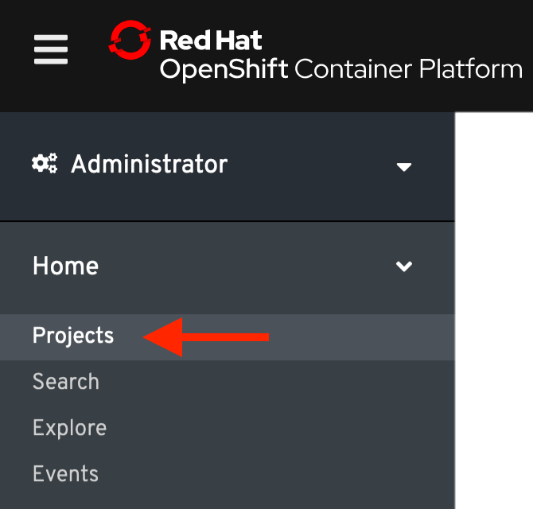
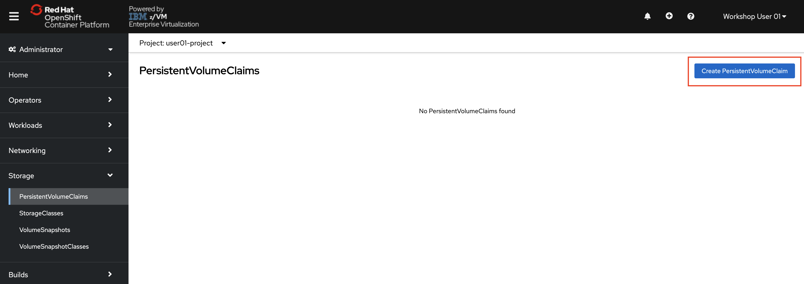
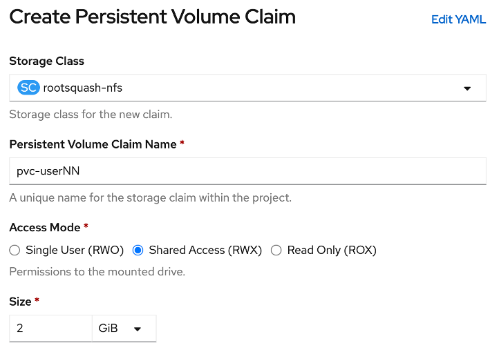
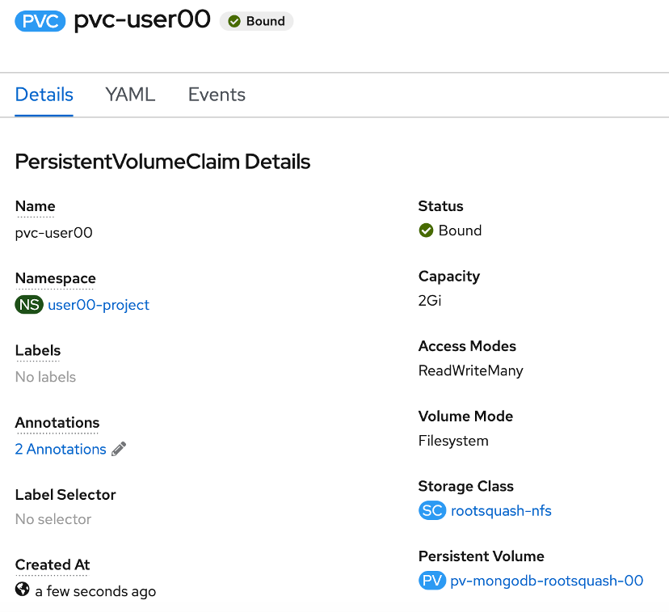

# Create a PersistentVolumeClaim

As described in a previous section, a PersistentVolume has been already been predefined for each lab user. Next you will create a PersistentVolumeClaim that will bind to one of the available PersistentVolumes.

1. **Change to the Administrator perspective**, if not already there.

1. **Navigate to the Projects page**. You can find it in the Menu, under Home -> Projects.

    

1. **Find and click on your userNN-project**.

1. Under the menu button, **click Storage -> Persistent Volume Claims**.

1. **Click “Create Persistent Volume Claim”**.

    

    The Create Persistent Volume Claim form has four fields, and you’ll need to manually change each.

    * **For Storage Class, select rootsquash-nfs**

    * **For Persistent Volume Claim Name, change the value to pvc-userNN** (Replacing NN with your user #).

    * **For Access Mode, select Shared Access (RWX**).

    * **For Size, change the value to 2 Gi**.

    Your form should look like the following:

    

1. **Click the create button**.

    You’ll be brought to the Overview for your newly created Persistent Volume Claim. The status of your claim should be *Bound*.

    

    ???+ Note
        If your PersistentVolumeClaim does not bind almost immediately to a PersistentVolume, you likely did not fill out the fields as described above. You can delete your persistent volume claim and try again by clicking on the Actions dropdown and selecting Delete Persistent Volume Claim.
