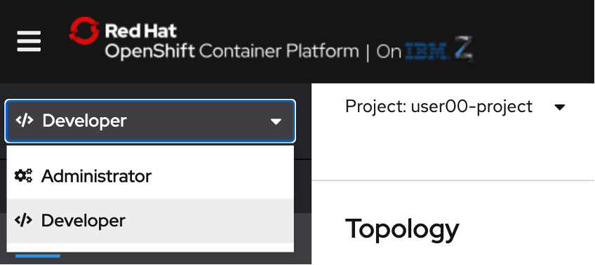
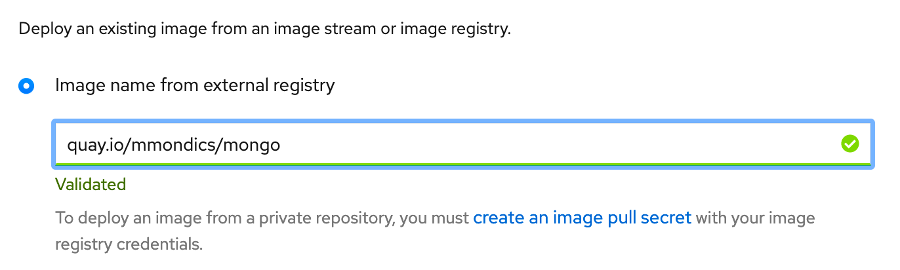
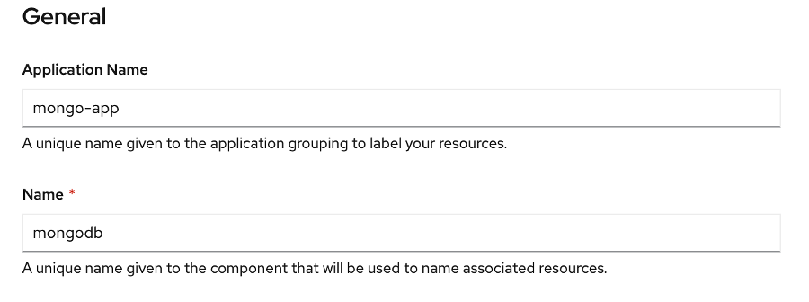
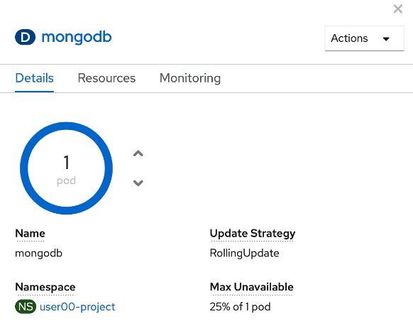
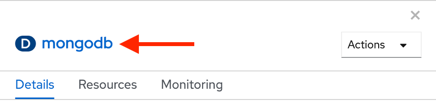
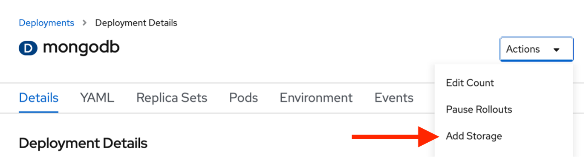
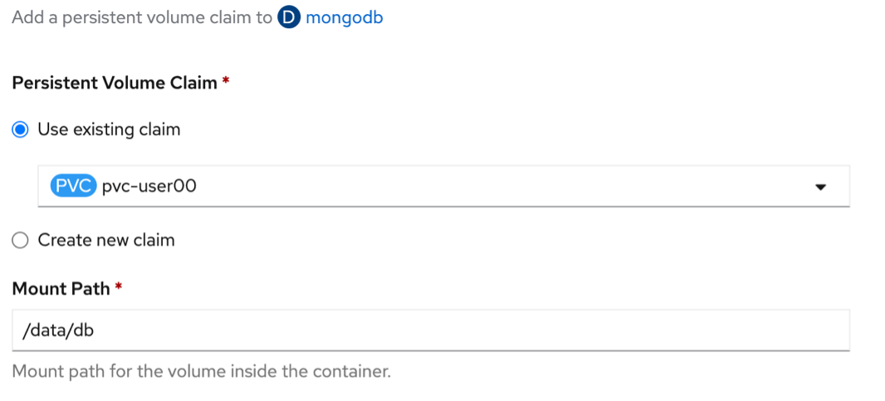
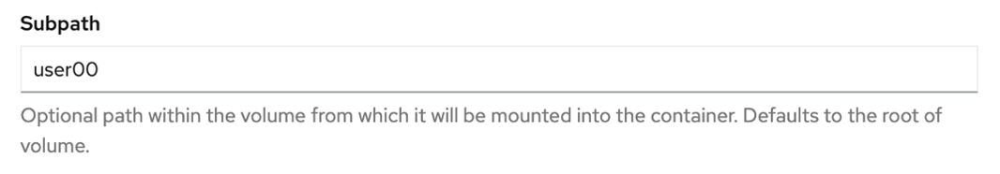
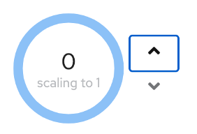
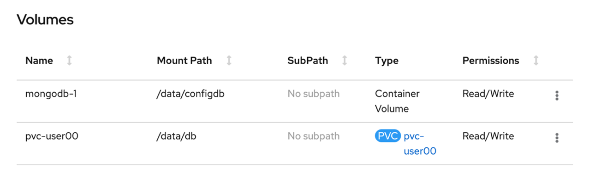

# Deploy MongoDB from a Container Image

In this section, you will be deploying a container using a MongoDB container image from quay.io. A container image holds a set of software that is ready to run, while a container is a running instance of a container image. Images can be hosted in registries, such as the quay.io registry, Docker Hub, or a private registry of your own.

1. **Toggle to the Developer Perspective and ensure you are in the correct userNN-project**.

    

1. **Click Add+ from the left-hand menu**.

1. **Click the Container Image tile**.

    This brings up a new page which prompts you for an image name and further configurable parameters further down the page. Only the image name is required, and the rest will automatically populate for you.

1. **In the search bar for Image Name from external registry, type `quay.io/mmondics/mongo`**.

    

    A green check mark and a “validated” message will appear in the search bar, indicating that the MongoDB image has been found and validated in Quay.

    ???+ Important ":warning: Important :warning:"
        The fields below will automatically populate, but ***it is imperative that you change the Name field for your MongoDB service***, or else the Node.js app will not be able to find and connect to the database.

1. **For Application Name, leave the default value**.

1. ***Replace the value of the Name field with mongodb***

1. **Leave Deployment and Create a Route to the Application checked**.

    

1. **Click the Create Button**.

    You will now be taken to the Topology view, where you will see an icon for your new MongoDB deployment.

1. **Click the icon for the mongodb deployment**.

    This will bring up a window on the right-hand side of the screen with information about your deployment.

1. **Select the Details tab**, if not already selected.

    

    Depending on how quickly you clicked the icon, it will display either 1 pod, or 0 scaling to 1. If it has not scaled up to 1 pod yet, it will after a few seconds. However, we’re going to be adding and removing storage, so we will kill the pod once it comes up.

1. **Click the Down Arrow** to reduce the pod count to zero.

    

    When a MongoDB pod is created, two storage volumes are attached to it. Let’s examine those.

1. **Click the mongodb deployment in the right-side window**.

    

1. **Once on the Deployment Details page, scroll down Volumes section**.

    Upon its creation, the pod created two volumes, mongodb-1 and mongodb-2. By default, MongoDB stores data in the `/data/db` directory, which is where the mongodb-2 volume has been mounted. This volume is not persistent. If the pod gets deleted, all of the stored data will be lost.

    To make your MongoDB data persistent, you are going to delete mongodb-2 and instead mount your persistent volume claim at /data/db.

1. **Click the three dots for the mongodb-2 volume**.

1. **Click Remove Volume**.

    

    Now, you’ll add persistent storage, mounting the volume at /data/db.

1. Still on the Deployment Details page, **scroll back up to the top and click the Actions dropdown**.

1. **Click Add Storage**.

    

    To add storage to your MongoDB deployment, you will need to fill out a couple of fields.

1. *Use Existing Claim should already be selected*.

1. **From the Select Claim dropdown menu, select pvc-userNN**.

1. **For Mount Path, enter `/data/db`**.

1. **For Subpath, enter your userNN**, where NN is your user number.

    

    

1. **Click the Save button**.

    You will now be returned to the Deployment Details page. In the same way that you reduced the pod count to zero, you will now bring it back up to one.

1. **Click the Up Arrow to increase the pod count to one**.

    

1. **Scroll Down to the section labeled Volumes**, and you’ll see the persistent volume now mounted at /data/db

    

    Now you’re ready to deploy the Node.js web application.
