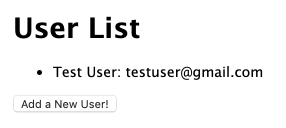
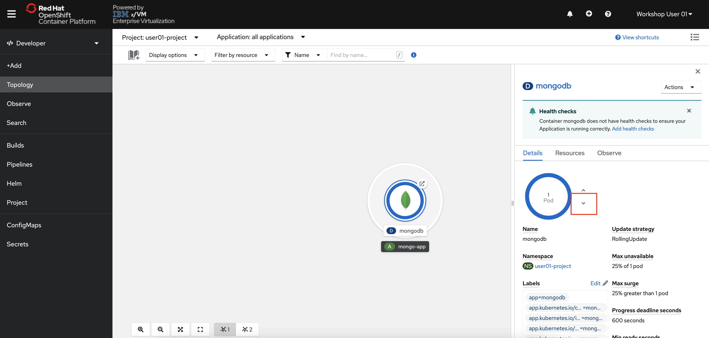
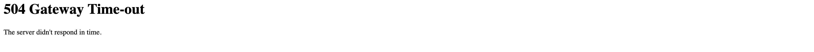

# Interacting with MongoDB from Node.js Web Application

You should be on the “Hello World” landing page of your Node.js web application. If you have moved off of this screen, refer to the previous section for instructions on how to access the application.

Since your application has not yet been used, the MongoDB database of user data will be empty. We can use the Node.js frontend application to insert data into the linked MongoDB pod and the persistent storage backing it.

1. **In the Node.js application, click the Add a New User button**.

    

    You will be brought to a new page titled Add New User.

1. **Enter a sample username and email and click Submit**.

    

    You will be brought to a page titled User List which displays the entire contents of your database. Feel free to add additional users.

    

    The data you just entered through the NodeJS web application is now stored in a MongoDB database backed by persistent storage on our NFS server. Now, let’s test that our data will persist if we simulate a database crash by deleting our MongoDB pod.

1. **Return to the OpenShift Console Developer Perspective and navigate to the Topology View**.

1. **Click the MongoDB icon**.

1. **Click the down arrow to reduce the pod count to zero, terminating the MongoDB pod**.

    

1. **Return to the Node.js web application and refresh the page**.

    The page will not connect, and if you wait long enough you will get a 504 Gateway Time-out error as the database no longer exists and no connection can be made.

    

1. **Back in OpenShift, click the up arrow to increase the pod count back to 1**.

1. **Return to the Node.js web application and refresh the page again**.

    Your data still exists, even though the MongoDB pod was terminated and replaced by a completely new one.

    In this section, a new MongoDB pod was created. Since you mounted NFS persistent storage at `/data/db` in the original MongoDB pod, your data persisted even when the original MongoDB pod was deleted and replaced with a new one. Without persistent storage, the new MongoDB pod would have contained an empty database.
