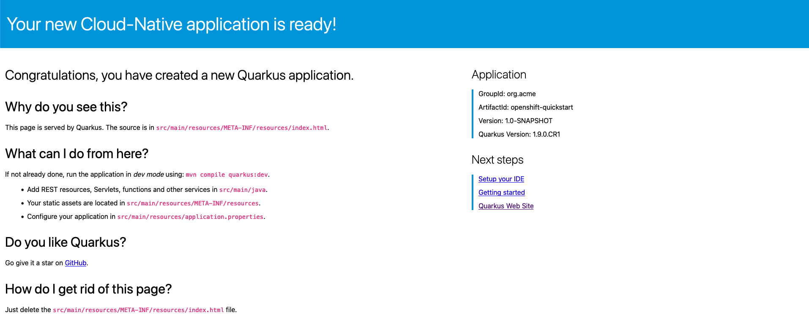

# Deploy the Application onto OpenShift

Let’s now take our local application and use the Quarkus extension we just added to build and deploy a containerized application onto OpenShift.

1. **In the openshift-quickstart directory, run the command**:

    ```bash
    ./mvnw clean package \
    -Dquarkus.kubernetes.deploy=true \
    -Dquarkus.kubernetes-client.trust-certs=true \
    -Dquarkus.openshift.expose=true
    ```

    The `-Dquarkus` flags in this command are telling Maven to deploy the application into the Kubernetes (OpenShift) cluster, trust the certificates, and expose the application service as a route, eliminating the need to run an `oc expose svc` to make the service endpoint accessible outside of the cluster.

    !!! Information
        This command may take a few minutes to complete.

    ???+ example "Example Output"

        ```bash
        user01@lab061:~/openshift-quickstart$ ./mvnw clean package \
            -Dquarkus.kubernetes.deploy=true \
            -Dquarkus.kubernetes-client.trust-certs=true \
            -Dquarkus.openshift.expose=true
        [INFO] Scanning for projects...
        [INFO] 
        [INFO] -------------------< org.acme:openshift-quickstart >--------------------
        [INFO] Building openshift-quickstart 1.0.0-SNAPSHOT
        [INFO] --------------------------------[ jar ]---------------------------------
        [INFO] 
        ...omitted...

        [INFO] [io.quarkus.kubernetes.deployment.KubernetesDeployer] The deployed application can be accessed at: http://openshift-quickstart-user01-project.apps.atsocppa.dmz
        [INFO] [io.quarkus.deployment.QuarkusAugmentor] Quarkus augmentation completed in 94655ms
        [INFO] ------------------------------------------------------------------------
        [INFO] BUILD SUCCESS
        [INFO] ------------------------------------------------------------------------
        [INFO] Total time:  03:19 min
        [INFO] Finished at: 2021-03-09T12:12:14-05:00
        [INFO] ------------------------------------------------------------------------
        ```

    The previous command builds a jar file locally, connects to the OpenShift cluster you previously logged into, triggers a container image build, pushes that container image into the OpenShift internal registry, generates OpenShift/Kubernetes resources including a Service, Route, DeploymentConfig, and your running application pod.

1. **View all of the created objects with the following command**:

    ```bash
    oc get all
    ```

    ???+ example "Example Output"

        ```bash
        user01@lab061: ~/openshift-quickstart$ oc get all
        NAME                                READY   STATUS      RESTARTS   AGE
        pod/openshift-quickstart-1-build    0/1     Completed   0          9m10s
        pod/openshift-quickstart-1-deploy   0/1     Completed   0          8m13s
        pod/openshift-quickstart-1-ndp8h    1/1     Running     0          8m10s

        NAME                                           DESIRED   CURRENT   READY   AGE
        replicationcontroller/openshift-quickstart-1   1         1         1       8m13s

        NAME                           TYPE        CLUSTER-IP      EXTERNAL-IP   PORT(S)    AGE
        service/openshift-quickstart   ClusterIP   172.30.28.241   <none>        8080/TCP   8m14s

        NAME                                                  REVISION   DESIRED   CURRENT   TRIGGERED BY
        deploymentconfig.apps.openshift.io/openshift-quickstart   1          1         1         image(openshift-quickstart:1.0-SNAPSHOT)

        NAME                                                  TYPE     FROM     LATEST
        buildconfig.build.openshift.io/openshift-quickstart   Source   Binary   1

        NAME                                              TYPE     FROM     STATUS     STARTED         DURATION
        build.build.openshift.io/openshift-quickstart-1   Source   Binary   Complete   9 minutes ago   55s

        NAME                    IMAGE REPOSITORY                                 TAGS                                      UPDATED
        imagestream.image.openshift.io/openjdk-11             default-route-openshift-image-registry.apps.atsocppa.dmz/user01-project/openjdk-11             1.3,1.3-3,1.3-3.1591609340 + 18 more...   9 minutes ago
        imagestream.image.openshift.io/openshift-quickstart   default-route-openshift-image-registry.apps.atsocppa.dmz/user01-project/openshift-quickstart   1.0-SNAPSHOT                              8 minutes ago

        NAME           HOST/PORT                        PATH      SERVICES               PORT   TERMINATION  
        route.route.openshift.io/openshift-quickstart  openshift-quickstart-user01-project.apps.atsocppa.dmz   /      openshift-quickstart   8080
        ```

    Each of these objects were created because of the `-Dquarkus.kubernetes.deploy=true` and `-Dquarkus.openshift.expose=true` flags provided in the previous command. There are many more OpenShift objects and object properties that can be created by passing different flags, such as liveliness probes, environment variables, secrets, persistent storage, and more.

    If you have one running pod, your application has successfully deployed and is accessible at the route.

1. **In a web browser, navigate to your route**:

    ??? Hint
        It will be <http://openshift-quickstart-userNN-project.apps.atsocppa.dmz/> where NN is your user number.

    

    Your Quarkus application is now deployed as a container in OpenShift.

    Earlier we looked at the GreetingResource.java REST endpoint and its return of “hello” in the command line. We can do the same thing in the web browser.

1. **Add** `/greeting` **to the end of your route**.

    ??? Hint
        <http://openshift-quickstart-userNN-project.apps.atsocppa.dmz/greeting> where NN is your user number.

    

    In this lab, you have created a Quarkus application locally, containerized the application and deployed it onto an OpenShift cluster running on IBM Z, and accessed it from a public route.

    The speed, agility, and ease with which we’re able to edit and redeploy applications using the Quarkus runtime creates tremendous value in time savings, allowing developers and operations staff to minimize downtime and keep applications up to date. Further, the simplicity of integration using Quarkus extensions creates great opportunity for customization and implementations tailored to fit a variety of needs.
