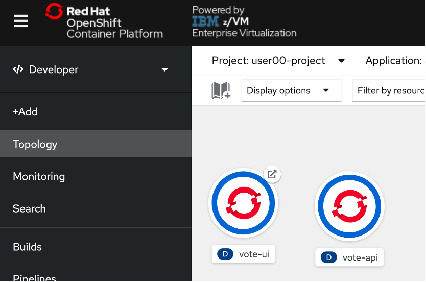
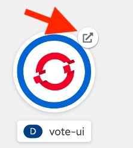
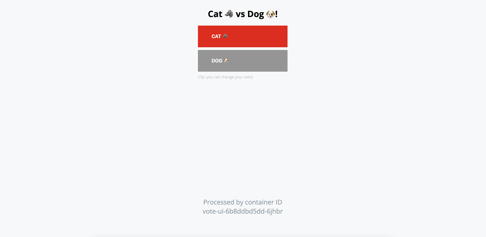

# Accessing the Pipeline in a Browser

Your application is accessible via its route.

1. In the OpenShift console, **navigate to the Topology page in the Developer Perspective and make sure you’re in your userNN-project**.

    

    You should see two Icons with solid blue bars indicating your application pods are running without error.

1. On the vote-ui icon, **click the button in the top right corner to navigate to the application’s exposed route**.

    

    This will open a new browser tab for your frontend application UI.

    

1. **Click the box for your desired option**.

    By casting your vote with the vote-ui frontend, you are invoking a REST API call and sending a POST request that is stored in the vote-api backend application.

    You can see this POST request reflected in the vote-api Pod logs.

1. **In your terminal session find the name of your vote-api Pod using the command**:

    ```bash
    oc get pods | grep Running
    ```

    ???+ example "Example Output"

        ```bash
        user01@lab061:~/openshift-pipelines-s390x$ oc get pods | grep Running
        vote-api-6765569bfb-p2bhh                                      1/1     Running     0          65m
        vote-ui-6846f88f6f-rzzgt                                       1/1     Running     0          18m
        ```

1. **Copy the full name for your vote-api Pod and view its logs with the command**:

    ```bash
    oc logs pod/vote-api-XXXXXXXXXX-YYYYY 
    ```

    !!! Important
        Your randomly-generated Pod names will differ.

    ???+ example "Example Output"

        ```bash
        user01@lab061:~/openshift-pipelines-s390x$ oc logs pod/vote-api-6765569bfb-p2bhh
        [GIN-debug] [WARNING] Creating an Engine instance with the Logger and Recovery middleware already attached.

        [GIN-debug] [WARNING] Running in "debug" mode. Switch to "release" mode in production.
        - using env:	export GIN_MODE=release
        - using code:	gin.SetMode(gin.ReleaseMode)

        [GIN-debug] GET    /vote                     --> main.setupRouter.func1 (3 handlers)
        [GIN-debug] POST   /vote                     --> main.setupRouter.func2 (3 handlers)
        [GIN-debug] Listening and serving HTTP on :9000
        [GIN] 2021/03/22 - 16:18:18 | 200 |     179.658µs |    10.131.1.157 | POST     /vote
        [GIN] 2021/03/22 - 16:18:48 | 200 |     107.379µs |    10.131.1.157 | POST     /vote
        ```

    You can see your POST requests at the `/vote` endpoint at the bottom, and more detail is stored in NFS by the PersistentVolumeClaim you created earlier.

In this lab, you have:

* Created Tasks that have specific responsibilities in the building and deploying of a containerized application onto an OpenShift on IBM Z cluster
* Created a Pipeline that combines these Tasks to one end-to-end process
* Ran the Pipeline twice -- once from the command line, and once from the OpenShift console -- to create a backend and a frontend application.
* Used the created applications to invoke a REST API call that is stored persistently in NFS storage.
