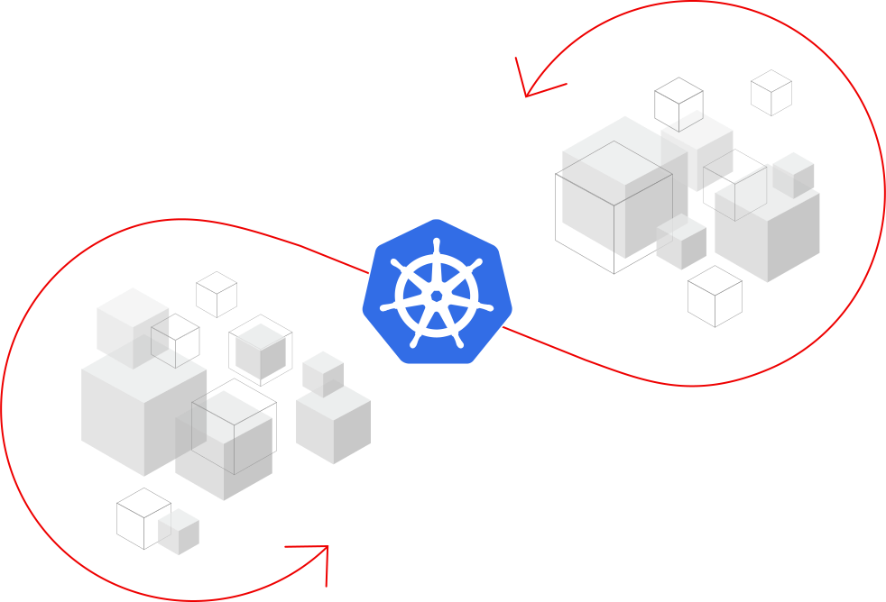
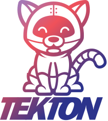

# Lab 009 - Using OpenShift Pipelines

**Red Hat OpenShift Pipelines** is a cloud-native, continuous integration and continuous delivery (CI/CD) solution based on Kubernetes resources. It uses Tekton building blocks to automate deployments across multiple platforms by abstracting away the underlying implementation details. Tekton introduces a number of standard custom resource definitions (CRDs) for defining CI/CD pipelines that are portable across Kubernetes distributions.

## Key features

* Red Hat OpenShift Pipelines is a *serverless* CI/CD system that runs pipelines with all the required dependencies in *isolated containers*.
* Red Hat OpenShift Pipelines are designed for *decentralized* teams that work on microservice-based architecture.
* Red Hat OpenShift Pipelines use *standard CI/CD pipeline definitions* that are easy to extend and integrate with the existing Kubernetes tools, enabling you to scale on-demand.
* You can use Red Hat OpenShift Pipelines to build images with Kubernetes tools such as Source-to-Image (S2I), Buildah, Buildpacks, and Kaniko that are portable across any Kubernetes platform.
* You can use the OpenShift Container Platform Developer console to create Tekton resources, view logs of pipeline runs, and manage pipelines in your OpenShift Container Platform namespaces.

## What is Tekton?

**Tekton** is an *open source* project that provides a framework to create *cloud-native CI/CD pipelines* quickly. As a *Kubernetes-native* framework, Tekton makes it easier to deploy across multiple cloud providers or hybrid environments. By leveraging the Custom Resource Definitions (CRDs) in Kubernetes, Tekton uses the Kubernetes control plane to run pipeline tasks. By using standard industry specifications, Tekton will work well with existing CI/CD tools such as Jenkins, Jenkins X, Skaffold, Knative, and now OpenShift.

Source of images and information on this page: <https://cloud.redhat.com/learn/topics/ci-cd>
