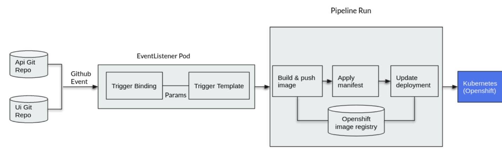
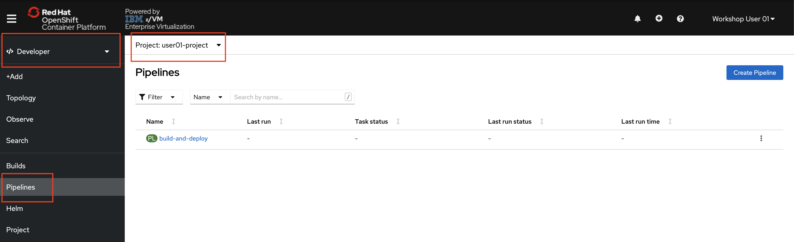

# Understanding and Deploying Pipelines

A *Pipeline* consists of a series of Tasks that are executed to construct complex workflows that automate the build, deployment, and delivery of applications. It is a collection of PipelineResources, parameters, and one or more Tasks.

Below is a diagram of the Pipeline you will be creating.



The repository you pulled provides the YAML file necessary to generate this Pipeline.

1. **Take a look at the YAML by using the command**:

    ```text
    cat pipeline/pipeline.yaml
    ```

    ???+ example "Example Output"

        ```text
        user01@lab061:~/openshift-pipelines-s390x$ cat tasks/hello.yaml
        apiVersion: tekton.dev/v1beta1
        kind: Pipeline
        metadata:
        name: build-and-deploy
        spec:
        workspaces:
        - name: shared-workspace
        params:
        - name: deployment-name
            type: string
            description: name of the deployment to be patched
        - name: git-url
            type: string
            description: url of the git repo for the code of deployment
        - name: git-revision
            type: string
            description: revision to be used from repo of the code for deployment
            default: "master"
        - name: IMAGE
            type: string
            description: image to be build from the code
        tasks:
        - name: fetch-repository
            taskRef:
            name: git-clone
            kind: ClusterTask
            workspaces:
            - name: output
            workspace: shared-workspace
            params:
            - name: url
            value: $(params.git-url)
            - name: subdirectory
            value: ""
            - name: deleteExisting
            value: "true"
            - name: revision
            value: $(params.git-revision)
        - name: build-image
            taskRef:
            name: buildah
            kind: ClusterTask
            params:
            - name: TLSVERIFY
            value: "false"
            - name: IMAGE
            value: $(params.IMAGE)
            workspaces:
            - name: source
            workspace: shared-workspace
            runAfter:
            - fetch-repository
        - name: apply-manifests
            taskRef:
            name: apply-manifests
            workspaces:
            - name: source
            workspace: shared-workspace
            runAfter:
            - build-image
        - name: update-deployment
            taskRef:
            name: update-deployment
            params:
            - name: deployment
            value: $(params.deployment-name)
            - name: IMAGE
            value: $(params.IMAGE)
            runAfter:
            - apply-manifests
        ```

    The Tasks included in this pipeline and their responsibilities are as follows:

    * *fetch-repository* clones the source code of the application from a GitHub repository based on the git-url and git-revision parameters.

    * *build-image* builds the container image of the application using Buildah.

    * *apply-manifests* deploys the application to OpenShift by running the oc apply command on the new container image with the provided parameters.

    * *update-deployment* will update the application in OpenShift with the oc patch command when changes are needed.

    You will notice that there are no references to the GitHub repository or the image registry that will be pushed to in the pipeline. This is because Pipelines are designed to be generic and re-used in different situations or to deploy different applications. Pipelines abstract away the specific parameters that can be passed into the Pipeline. When triggering the Pipeline, you will provide different GitHub repositories and images to be used when executed.

    Also notice that the execution order of Tasks can be determined by dependencies defined between Tasks via inputs and outputs, or explicitly ordered via runAfter.

1. **Create the Pipeline with the command**:

    ```text
    oc create -f pipeline/pipeline.yaml
    ```

    ???+ example "Example Output"

        ```text
        user01@lab061:~/openshift-pipelines-s390x$ oc create -f pipeline/pipeline.yaml
        pipeline.tekton.dev/build-and-deploy created
        ```

    Although we are using pre-built YAML files to simplify the creation of these resources, everything in this lab could also be done in the OpenShift console in a browser.

1. **Take a look at the graphical representation of your Pipeline by accessing the cluster at the URL: <https://console-openshift-console.apps.atsocppa.dmz/>**

    Username: userNN (where NN is your user number)
    Password: p@ssw0rd

1. **Navigate to the Developer Perspective -> Pipelines -> select your userNN Project**.

    

1. **Click your new Pipeline** called `build-and-deploy`.

    

    The framework of your Pipeline has been created, and you can see the four Tasks that make up your Pipeline.

    !!! Information
        If you remember making the apply-manifests and update-deployment Tasks, but not the “fetch-repository” and “build-image” Tasks -- you aren’t wrong. These are ClusterTasks that come pre-built into OpenShift.

In the next section you will trigger a PipelineRun to execute your Pipeline and the Tasks it contains.
