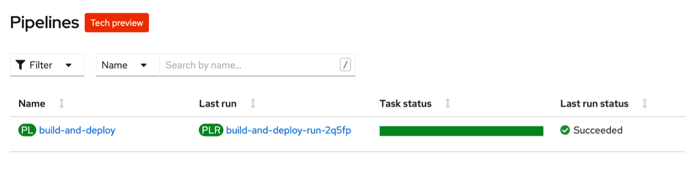
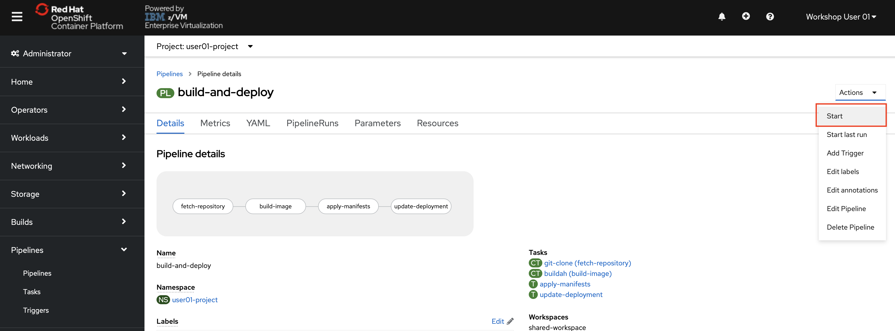
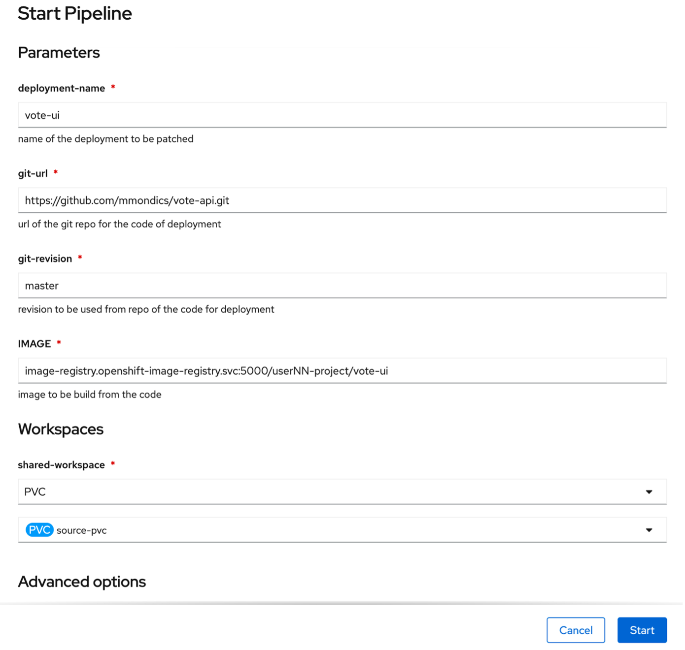
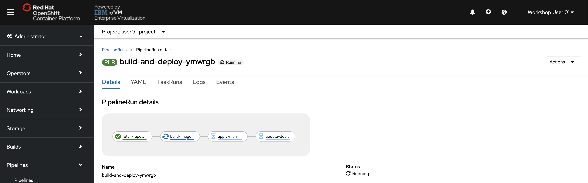

# Running the Pipeline

Let’s use this Pipeline to create an application. To demonstrate the re-usability of OpenShift Pipelines, we will be creating both a frontend and a backend with the same Pipeline you created in the previous step.

We’ll also demonstrate the flexibility provided by OpenShift Pipelines that lets you use them from either the web console or the command line.

Let’s create the backend application with the Tekton CLI in your terminal.

Now that you have all of the building blocks in place, you can start the Pipeline with the following command. The command will run the Pipeline and pass in parameters to:

* Use the shared workspace and the PersistentVolumeClaim you created

* Create the deployment named vote-api

* Build a container image from the source code at the given GitHub repository

* Push that container image into the OpenShift internal registry and tag it for your project

* Show the log so you can follow its progress
Note that the forward slash \ simply breaks the command into multiple lines for readability.

## Creating the Backend Application through the CLI

1. **Run the following command**:

    ```text
    tkn pipeline start build-and-deploy \
     -w name=shared-workspace,claimName=source-pvc \
     -p deployment-name=vote-api \
     -p git-url=https://github.com/mmondics/pipelines-vote-api.git \
     -p IMAGE=image-registry.openshift-image-registry.svc:5000/userNN-project/pipelines-vote-api --showlog 
    ```

    !!! Important ":warning: Important :warning:"
        Make sure you change the one instance of `NN` to your team number in the command above.

    ??? example "Expand for Example Output"

        ```text
        user01@lab061:~/openshift-pipelines-s390x$ tkn pipeline start build-and-deploy \
        > -w name=shared-workspace,claimName=source-pvc \
        > -p deployment-name=vote-api \
        > -p git-url=https://github.com/mmondics/vote-api.git \
        > -p IMAGE=image-registry.openshift-image-registry.svc:5000/userNN-project/vote-api \
        > --showlog
        PipelineRun started: build-and-deploy-run-75zqv
        Waiting for logs to be available...
        [fetch-respository : clone] + CHECKOUT_DIR=/workspace/output/
        [fetch-respository : clone] + [[ true == \t\r\u\e ]]
        [fetch-respository : clone] + cleandir
        [fetch-respository : clone] + [[ -d /workspace/output/ ]]
        [fetch-respository : clone] + rm -rf /workspace/output//Dockerfile /workspace/output//LICENSE /workspace/output//README.md /workspace/output//go.mod /workspace/output//go.sum /workspace/output//k8s /workspace/output//main.go /workspace/output//vendor
        [fetch-respository : clone] + rm -rf /workspace/output//.git /workspace/output//.gitignore
        [fetch-respository : clone] + rm -rf '/workspace/output//..?*'
        [fetch-respository : clone] + test -z ''
        [fetch-respository : clone] + test -z ''
        [fetch-respository : clone] + test -z ''
        [fetch-respository : clone] + /ko-app/git-init -url https://github.com/mmondics/vote-api.git -revision master -refspec '' -path /workspace/output/ -sslVerify=true -submodules=true -depth 1
        [fetch-respository : clone] {"level":"info","ts":1616101272.5251348,"caller":"git/git.go:165","msg":"Successfully cloned https://github.com/mmondics/vote-api.git @ a08f579f6135293358b9423a3370e725ae1380cc (grafted, HEAD, origin/master) in path /workspace/output/"}
        [fetch-respository : clone] {"level":"info","ts":1616101272.6701891,"caller":"git/git.go:203","msg":"Successfully initialized and updated submodules in path /workspace/output/"}
        [fetch-respository : clone] + cd /workspace/output/
        [fetch-respository : clone] ++ git rev-parse HEAD
        [fetch-respository : clone] + RESULT_SHA=a08f579f6135293358b9423a3370e725ae1380cc
        [fetch-respository : clone] + EXIT_CODE=0
        [fetch-respository : clone] + '[' 0 '!=' 0 ']'
        [fetch-respository : clone] + echo -n a08f579f6135293358b9423a3370e725ae1380cc
        [fetch-respository : clone] + echo -n https://github.com/mmondics/vote-api.git

        [build-image : build] + buildah --storage-driver=vfs bud --format=oci --tls-verify=false --no-cache -f ./Dockerfile -t image-registry.openshift-image-registry.svc:5000/user00-project/vote-api .
        [build-image : build] STEP 1: FROM image-registry.openshift-image-registry.svc:5000/openshift/golang:latest AS builder
        [build-image : build] Getting image source signatures
        [build-image : build] Copying blob sha256:ff637d5a66cba4903fc7d9343b0f9dbb4e1bf8ada19bd3934ea0edfb85dc4
        [build-image : build] Copying blob sha256:f7fb0662b957bcb1b5007f9b5502af4da4c13e17b7bc2eff4f02c3e5ec08e
        [build-image : build] Copying blob sha256:35aab756d1a095511ab75eeca5aa77a37fa62a258f3fa5bcfb37ad604e369
        [build-image : build] Copying blob sha256:7cc70ce0e0ee7fe5f8ea22894ad8c2f962f1dfdd00d05de91a32181c89179
        [build-image : build] Copying blob sha256:73986f838dc404255946f6aa282b0aeabc420faa4f21b572e1de735498edf
        [build-image : build] Copying config sha256:9e8f033b036bdb224dc931cfcaaf532da6a6ae7d779e8a09c52eed12305
        [build-image : build] Writing manifest to image destination
        [build-image : build] Storing signatures
        [build-image : build] STEP 2: WORKDIR /build
        [build-image : build] STEP 3: ADD . /build/
        [build-image : build] STEP 4: RUN export GARCH="$(uname -m)" && if [[ ${GARCH} == "s390x" ]]; then export GARCH="s390x"; fi && GOOS=linux GOARCH=${GARCH} CGO_ENABLED=0 go build -mod=vendor -o api-server 
        [build-image : build] STEP 5: FROM scratch
        [build-image : build] STEP 6: WORKDIR /app
        [build-image : build] STEP 7: COPY --from=builder /build/api-server /app/api-server
        [build-image : build] STEP 8: CMD [ "/app/api-server" ]
        [build-image : build] STEP 9: COMMIT image-registry.openshift-image-registry.svc:5000/user00-project/vote-api
        [build-image : build] --> 36faca61f94
        [build-image : build] 36faca61f941af886128abd8792753095eaac7c1041084e222f426243ed50ecc

        [build-image : push] + buildah --storage-driver=vfs push --tls-verify=false --digestfile /workspace/source/image-digest image-registry.openshift-image-registry.svc:5000/user00-project/vote-api docker://image-registry.openshift-image-registry.svc:5000/user00-project/vote-api
        [build-image : push] + buildah --storage-driver=vfs push --tls-verify=false --digestfile /workspace/source/image-digest image-registry.openshift-image-registry.svc:5000/user00-project/vote-api docker://image-registry.openshift-image-registry.svc:5000/user00-project/vote-api
        [build-image : push] Getting image source signatures
        [build-image : push] Copying blob sha256:9eda1116f7414b98e397f94cc650fd50890c2d97fa47925e02b83df7726119
        [build-image : push] Copying config sha256:36faca61f941af886128abd8792753095eaac7c1041084e222f426243ed5
        [build-image : push] Writing manifest to image destination
        [build-image : push] Storing signatures

        [build-image : digest-to-results] + cat /workspace/source/image-digest
        [build-image : digest-to-results] + tee /tekton/results/IMAGE_DIGEST
        [build-image : digest-to-results] sha256:a7d730f92530c2f10891c55ba86a44e4fcc907436831c99733779ffb0d0fe8

        [apply-manifests : apply] Applying manifests in k8s directory
        [apply-manifests : apply] deployment.apps "vote-api" created
        [apply-manifests : apply] service "vote-api" created
        [apply-manifests : apply] -----------------------------------

        [update-deployment : patch] deployment.apps "vote-api" patched

        ```

    If you see the final `deployment.apps “vote-api” patched` line, your PipelineRun was successful and your backend application is now deployed in OpenShift.

1. **Look at your running application Pod by issuing the command**:

    ```text
    oc get pod
    ```

    ???+ example "Example Output"

        ```text
        user01@lab061:~/openshift-pipelines-s390x$ oc get pod
        NAME                                                           READY   STATUS      RESTARTS   AGE
        build-and-deploy-run-sgtc7-apply-manifests-9p6mv-pod-95jhw     0/1     Completed   0          9m52s
        build-and-deploy-run-sgtc7-build-image-6kh6n-pod-pkvgx         0/3     Completed   0          12m
        build-and-deploy-run-sgtc7-fetch-repository-flxfx-pod-p6nzh    0/1     Completed   0          13m
        build-and-deploy-run-sgtc7-update-deployment-hgxrz-pod-htqpf   0/1     Completed   0          9m33s
        vote-api-6765569bfb-v4jlh                                      1/1     Running     0          9m20s
        ```

    You should see one *running* Pod and four *completed* Pods. The running Pod is your application that the Pipeline pulled from GitHub, containerized, pushed into the internal OpenShift repository, and started. The completed Pods were created to complete the Tasks defined in the Pipeline, and each is made up of one container per step in the Task.

    Looking at the READY column, you can see that most of the Pods have one container, with the exception of the build-image Pod that has three.

1. **The Tekton CLI also provides a way to check your Pipelines and PipelineRuns by running**:

    ```text
    tkn pipeline ls
    ```

    ???+ example "Example Output"

        ```text
        user01@lab061:~/openshift-pipelines-s390x$ tkn pipeline ls
        NAME               AGE             LAST RUN                     STARTED         DURATION    STATUS
        build-and-deploy   4 minutes ago   build-and-deploy-run-2q5fp   4 minutes ago   3 minutes   Succeeded
        ```

Since we have successfully run the Pipeline in the CLI, let’s trigger a run from the console in the next section.

## Creating the Frontend Application through the Console

Let’s create the frontend portion of our application by running the Pipeline from the OpenShift console.

1. **If you’ve closed out of the OpenShift console in your web browser, go back to <https://console-openshift-console.apps.atsocppa.dmz/>**

1. **Navigate to the Developer Perspective -> Pipelines -> and select your userNN Project**.

    

    The main Pipelines page displays the same information returned from the `tkn pipeline ls` command.

1. **Click your build-and-deploy Pipeline and then click the Actions -> Start button**.

    

    This will open a new window that prompts you for the parameters with which to start your second PipelineRun. This window is the GUI equivalent to the multi-line `tkn pipeline start` command that we entered in the CLI PipelineRun.

1. **Enter the following parameters**:

    * deployment name: `vote-ui`
    
    * git-url: `https://github.com/mmondics/pipelines-vote-ui.git`

    * git-revision: `master`

    * IMAGE: `image-registry.openshift-image-registry.svc:5000/userNN-project/vote-ui`

    * shared-workspace: `PersistentVolumeClaim` -> `source-pvc`

    !!! Important
        Make sure you change the one instance of `NN` in the IMAGE field to your user number.

1. **Then click start**.

    

    You will be taken to the page for your PipelineRun and shown the graphical representation of the running Pipeline.

    

1. **Click the logs tab** to follow what’s happening in more detail like you saw in the CLI.

    

When you see the PipelineRun has Succeeded and the `deployment.apps “vote-ui” has been patched`, your frontend application is also up and running.

With both your backend and frontend applications are running, in the next section we’ll access it in a browser.
