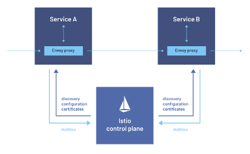

# OpenShift Service Mesh Architecture

!!! Important
    Work In Progress

OpenShift Service Mesh is logically split into a *data plane* and a *control plane*:

The *data plane* is a set of intelligent proxies deployed as sidecars. These proxies intercept and control all inbound and outbound network communication between microservices in the service mesh.

* Envoy proxy intercepts all inbound and outbound traffic for all services in the service mesh. Envoy is deployed as a sidecar to the relevant service in the same pod.

The *control plane* manages and configures *Istiod* to enforce proxies to route traffic.

*Istiod* provides service discovery, configuration and certificate management. It converts high-level routing rules to Envoy configurations and propagates them to the sidecars at runtime.
