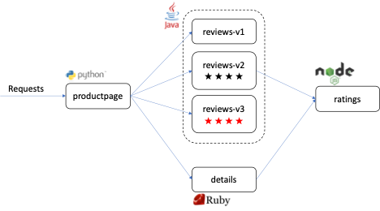

# Deploying an Application on the Service Mesh

The first thing we will do is deploy our application - *Bookinfo*. [Bookinfo](https://istio.io/latest/docs/examples/bookinfo/) is a sample application provided by Istio, the upstream project from which OpenShift Service Mesh is built.

The application displays information about a book, similar to a single catalog entry of an online bookstore. Displayed on the page is a description of the book, book details (ISBN, number of pages, and so on), and a few book reviews.

The Bookinfo application is broken into four separate microservices:

* *productpage*. The productpage microservice calls the details and reviews microservices to populate the page.
* *details*. The details microservice contains book information.
* *reviews*. The reviews microservice contains book reviews. It also calls the ratings microservice.
* *ratings*. The ratings microservice contains book ranking information that accompanies a book review.

There are 3 versions of the reviews microservice:

* Version *v1* doesn’t call the ratings service.
* Version *v2* calls the ratings service and displays each rating as 1 to 5 black stars.
* Version *v3* calls the ratings service and displays each rating as 1 to 5 red stars.

The end-to-end architecture of the application is shown below.



!!! Information
    This application is *polyglot*, i.e., the microservices are written in different languages. It’s worth noting that these microservices have no dependencies on the Istio or OSSM, but make an interesting Service Mesh example, particularly because of the multitude of microservices, languages and versions for the reviews microservice.

To run Bookinfo on the Service Mesh requires *no changes to the application itself*. You simply need to run the application in a Service Mesh-enabled environment, with Envoy sidecars injected alongside each microservice.

Our OpenShift environment is Service Mesh enabled. OSSM is already installed in our OpenShift cluster and is configured to watch for Service Mesh-enabled deployments to appear in your project, userNN-project. The Service Mesh knows which project to watch through an instance of the Istio Service Mesh Member Roll custom resource. Your userNN ID is not able to access this custom resource, but it is displayed below for your reference.

???+ example "Example Output"

    ```text
    user01@lab061:~/istio-s390x$ oc describe ServiceMeshMemberRoll/default
    Name:         default
    Namespace:    istio-system
    Labels:       <none>
    Annotations:  <none>
    API Version:  maistra.io/v1
    Kind:         ServiceMeshMemberRoll
    Spec:
    Members:
        user01-project
        user02-project
        user03-project
        user04-project
        user05-project
    Status:
    Annotations:
        Configured Member Count:  5/5
    Conditions:
        Last Transition Time:  2021-06-28T19:04:47Z
        Message:               All namespaces have been configured successfully
        Reason:                Configured
        Status:                True
        Type:                  Ready
    Configured Members:
        user01-project
        user02-project
        user03-project
        user04-project
        user05-project
    Mesh Generation:          1
    Mesh Reconciled Version:  2.0.6-2.el8-1
    Observed Generation:      6
    Pending Members:
    Events:  <none>
    ```

???+ Note
    The screenshot above has been trimmed down for brevity. User projects up to user30-project are configured.

This custom resource will watch each member project and automatically inject Envoy sidecars when a deployment is created with the annotation `sidecar.istio.io/inject: "true"`.

The deployments contained in the GitHub repository you pulled already have this annotation configured.

1. **From the Istio-s390x directory, view the application deployments with the command**:

    ```text
    cat platform/kube/bookinfo.yaml
    ```

    You will find that this YAML file contains a Service, a ServiceAccount, and a Deployment for each of the microservices described previously. Find a section of the YAML file that has kind: Deployment, and you will see the `sidecar.istio.io/inject: "true"` annotation in its spec section.

    ???+ example "Example Output"

        ```text
            apiVersion: apps/v1
            kind: Deployment
            metadata:
            name: details-v1
            labels:
                app: details
                version: v1
            spec:
            replicas: 1
            selector:
                matchLabels:
                app: details
                version: v1
            template:
                metadata:
                annotations:
                    sidecar.istio.io/inject: "true"
                labels:
                    app: details
                    version: v1
                spec:
                serviceAccountName: bookinfo-details
                containers:
                - name: details
                    image: quay.io/mmondics/examples-bookinfo-details-v1:1.16.2
                    imagePullPolicy: IfNotPresent
                    ports:
                    - containerPort: 9080
        ```

    Once created, this YAML file will set up the entire Bookinfo application for you and the Envoy proxy sidecars will be automatically injected for the Istio control plane to interact with.

1. **Create the application by running the following command**:

    ```text
    oc create -f platform/kube/bookinfo.yaml
    ```

    ???+ example "Example Output"

        ```text
            user01@lab061:~/istio-s390x$ oc create -f platform/kube/bookinfo.yaml
            oc create -f platform/kube/bookinfo.yaml 
            service/details created
            serviceaccount/bookinfo-details created
            deployment.apps/details-v1 created
            service/ratings created
            serviceaccount/bookinfo-ratings created
            deployment.apps/ratings-v1 created
            service/reviews created
            serviceaccount/bookinfo-reviews created
            deployment.apps/reviews-v1 created
            deployment.apps/reviews-v2 created
            deployment.apps/reviews-v3 created
            service/productpage created
            serviceaccount/bookinfo-productpage created
            deployment.apps/productpage-v1 created
        ```

        Although not yet accessible, all of the application components should be up and running within a few seconds.

1. **Check that your four services were created with**:

    ```text
    oc get services
    ```

    ???+ example "Example Output"

        ```text
            user01@lab061:~/istio-s390x$ oc get services
            NAME          TYPE        CLUSTER-IP       EXTERNAL-IP   PORT(S)    AGE
            details       ClusterIP   172.30.237.245   <none>        9080/TCP   10s
            productpage   ClusterIP   172.30.73.57     <none>        9080/TCP   10s
            ratings       ClusterIP   172.30.241.30    <none>        9080/TCP   10s
            reviews       ClusterIP   172.30.34.195    <none>        9080/TCP   10s
        ```

1. **And check that your six pods have been created with**:

    ```text
    oc get pods
    ```

    ???+ example "Example Output"

        ```text
            user01@lab061:~/istio-s390x$ oc get services
            NAME                              READY   STATUS    RESTARTS   AGE
            details-v1-78cb8b797f-ndqdz       2/2     Running   0          45s
            productpage-v1-568ddd75bf-rmqtf   2/2     Running   0          45s
            ratings-v1-768dc65999-q5dft       2/2     Running   0          45s
            reviews-v1-6cf69f46c9-wbtqm       2/2     Running   0          45s
            reviews-v2-64fd74bbd7-hx4rd       2/2     Running   0          46s
            reviews-v3-8cb65c475-wr22r        2/2     Running   0          46s
        ```

    Each pod should have a *STATUS*: Running and should show *Ready*: 2/2. The 2/2 indicates that the pod includes two containers, and both are ready. In our case, each pod has one container for its application, and one container for the Envoy proxy, or sidecar.

    ??? Note "Optional"
        You can list the containers in your productpage pod with the command:

        ```text
        oc get pod productpage-v1-xxxxx -o jsonpath={.spec.containers[*].name}
        ```

        (where xxxxx is your randomly generated string of characters returned by oc get pods)

        ```text
        user01@lab061:~/istio-s390x$ oc get pod productpage-v1-78797f -o jsonpath={.spec.containers[*].name}
        productpage istio-proxyuser01@lab061:~/istio-s390x$
        ```

        Your two container names will be printed at the beginning of the next line - productpage, and Istio-proxy.

    productpage is the end user’s primary ingress into the Bookinfo application. This is the microservice that will pull the data from the ratings, reviews, and details microservices and display them when requested by a user.

1. **Check that the productpage microservice is running correctly by issuing the command**:

    ```text
    oc exec "$(oc get pod -l app=ratings -o jsonpath='{.items[0].metadata.name}')" -c ratings -- curl -sS productpage:9080/productpage | grep -o "<title>.*</title>"
    ```

    ???+ example "Example Output"

        ```text
            user01@lab061:~/istio-s390x$ oc exec "$(oc get pod -l app=ratings -o jsonpath='{.items[0].metadata.name}')" -c ratings -- curl -sS productpage:9080/productpage | grep -o "<title>.*</title>"
            <title>Simple Bookstore App</title>
        ```

    If you see `<title>Simple Bookstore App</title>` returned, your Bookinfo application is working correctly, yet still inaccessible.

In the next section, we will create a Gateway to provide ingress into the Service Mesh application.
