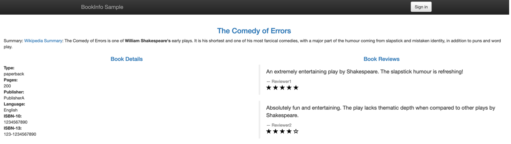

# Understanding and Deploying a Service Mesh Gateway and VirtualService

Gateways are used to manage inbound and outbound traffic for your mesh, letting you specify which traffic you want to enter or leave the mesh. Gateway configurations are applied to standalone Envoy proxies that are running at the edge of the mesh, rather than sidecar Envoy proxies running alongside your service workloads.


Unlike other mechanisms for controlling traffic entering your systems, such as the Kubernetes Ingress APIs, Istio gateways let you use the full power and flexibility of Istio’s traffic routing. You can do this because Istio’s Gateway resource just lets you configure layer 4-6 load balancing properties such as ports to expose, TLS settings, and so on. Then instead of adding application-layer traffic routing (L7) to the same API resource, you bind a regular Istio virtual service to the gateway. This lets you basically manage gateway traffic like any other data plane traffic in an Istio mesh.

Gateways are primarily used to manage ingress traffic, but you can also configure egress gateways. An egress gateway lets you configure a dedicated exit node for the traffic leaving the mesh, letting you limit which services can or should access external networks, or to enable secure control of egress traffic to add security to your mesh, for example. We will only be deploying an ingress Gateway in this lab.

Along with a Gateway, we will need a *VirtualService*. A VirtualService defines a set of traffic routing rules to apply when a host is addressed. Each routing rule defines matching criteria for traffic of a specific protocol. If the traffic is matched, then it is sent to a named destination service (or subset/version of it) defined in the registry.

1. You will find a YAML file for a Gateway and VirtualService in your terminal session. **From the istio-s390x directory, view the YAML file with the command**:

    ```text
    cat networking/bookinfo-gateway.yaml
    ```

    ???+ example "Example Output"

        ```yaml
            apiVersion: networking.istio.io/v1alpha3
            kind: Gateway
            metadata:
            name: bookinfo-gateway
            spec:
            selector:
                istio: ingressgateway # use default controller
            servers:
            - port:
                number: 80
                name: http
                protocol: HTTP
                hosts:
                - "userNN-project.istio.apps.atsocppa.dmz"
            ---
            apiVersion: networking.istio.io/v1alpha3
            kind: VirtualService
            metadata:
            name: bookinfo
            spec:
            hosts:
            - "userNN-project.istio.apps.atsocppa.dmz"
            gateways:
            - bookinfo-gateway
            http:
            - match:
                - uri:
                    exact: /productpage
                - uri:
                    prefix: /static
                - uri:
                    exact: /login
                - uri:
                    exact: /logout
                - uri:
                    prefix: /api/v1/products
                route:
                - destination:
                    host: productpage
                    port:
                    number: 9080
        ```

    You will notice that there are a few instances of userNN in the YAML file that must be edited to match your user number. You can quickly change these by entering the following command.

    ??? Information "Expand for more information"
        Extra information for those interested…

        The hosts field lists the VirtualService’s hosts - in other words, the user-addressable destination or destinations that these routing rules apply to. This is the address or addresses used when sending requests to the service.

        The virtual service hostname can be an IP address, a DNS name, or, depending on the platform, a short name (such as a Kubernetes service short name) that resolves to a fully qualified domain name (FQDN). You can also use wildcard (”*”) prefixes, letting you create a single set of routing rules for all matching services.

        The http section contains the virtual service’s routing rules, describing match conditions and actions for routing HTTP/1.1, HTTP2, and gRPC traffic sent to the destination(s) specified in the hosts field (you can also use tcp and tls sections to configure routing rules for TCP and unterminated TLS traffic). A routing rule consists of the destination where you want the traffic to go and zero or more match conditions, depending on your use case.

        The route section’s destination field specifies the actual destination for traffic that matches this condition. Unlike the VirtuallService’s host(s), the destination’s host must be a real destination that exists in Istio’s service registry or Envoy won’t know where to send traffic to it. This can be a mesh service with proxies or a non-mesh service added using a service entry. In this case we’re running on Kubernetes and the host name is a Kubernetes service name.

1. **Make sure that you change <YOUR_USER_NUMBER> to the correct number**, i.e. 01 for user01

    ```text
    sed -i 's/NN/<YOUR_USER_NUMBER>/g' networking/bookinfo-gateway.yaml
    ```

1. **Create the Gateway and VirtualService with the following command**:

    ```text
    oc create -f networking/bookinfo-gateway.yaml
    ```

    ???+ example "Example Output"

        ```text
        user01@lab061:~/istio-s390x$ oc create -f networking/bookinfo-gateway.yaml
        gateway.networking.istio.io/bookinfo-gateway created
        virtualservice.networking.istio.io/bookinfo created

        ```

1. **And view the new objects with the command**:

    ```text
    oc get gateway,virtualservice
    ```

    !!! Note
    This command will *not* work if there is a space after the comma.

    ???+ example "Example Output"

        ```text
        user01@lab061:~/istio-s390x$ oc get gateway,virtualservice
        NAME                       AGE
        gateway/bookinfo-gateway   42s

        NAME                      GATEWAYS               HOST               
        virtualservice/bookinfo   ["bookinfo-gateway"]   ["user15-project.istio.apps.atsocppa.dmz"]

        ```

    With this Gateway and VirtualService, you are now able to access the application.

1. **First, identify your Gateway URL by entering the following command in your terminal**:

    ```text
    export GATEWAY_URL=$(oc get virtualservice bookinfo -o jsonpath='{.spec.hosts[0]}')
    ```

1. **Next, enter the following command to print your productpage URL**:

    ```text
    echo "http://$GATEWAY_URL/productpage"
    ```

    ???+ example "Example Output"

        ```text
        user01@lab061:~/istio-s390x$ export GATEWAY_URL=$(oc get virtualservice bookinfo -o jsonpath='{.spec.hosts[0]}')
        user01@lab061:~/istio-s390x$ echo "http://$GATEWAY_URL/productpage"
        user01@lab061:~/istio-s390x$ http://user15-project.istio.apps.atsocppa.dmz/productpage

        ```

1. **Copy the URL that is returned, and paste it into a web browser**

    !!! Hint
        The URL will be similar to <http://userNN-project.istio.apps.atsocppa.dmz/productpage>, (where NN is your user number).

    

    If all is working correctly, the overall productpage is shown, which displays information about William Shakespeare’s play, The Comedy of Errors. The details on the left are returned by the details microservice, the text for the two reviews is provided by the ratings microservice, and the star ratings (or lack thereof) are returned by one of the three reviews microservices, depending on which was called by the ratings microservice.

    You now have an application made up of six microservices written in four different languages deployed on the OpenShift Service Mesh and can now take full advantage of its features. We will look at a subset of them in the following sections.
