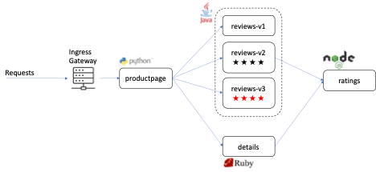

# Traffic Management

Istio’s traffic routing rules let you easily control the flow of traffic and API calls between services. Istio simplifies configuration of service-level properties like circuit breakers, timeouts, and retries, and makes it easy to set up important tasks like A/B testing, canary rollouts, and staged rollouts with percentage-based traffic splits. It also provides out-of-box failure recovery features that help make your application more robust against failures of dependent services or the network.

1. **Refresh the productpage a few times** and you will see either black stars, red stars, or no stars.

    This is because, by default, Istio uses a *round-robin load balancing* policy, where each service instance in the instance pool gets a request in turn. Istio also supports the following models, which you can specify in destination rules for requests to a particular service or service subset.

    * Random: Requests are forwarded at random to instances in the pool.
    * Weighted: Requests are forwarded to instances in the pool according to a specific percentage.
    * Least requests: Requests are forwarded to instances with the least number of requests.

    Along with VirtualServices, *DestinationRules* are a key part of Istio’s traffic routing functionality. You can think of virtual services as how you route your traffic to a given destination, and then you use destination rules to configure what happens to traffic for that destination. Destination rules are applied after virtual service routing rules are evaluated, so they apply to the traffic’s “real” destination.

1. There is a DestinationRule YAML file provided in the networking directory. **Take a look at it with**:

    ```bash
    cat networking/destination-rule-all.yaml
    ```

    ???+ example "Example Output"

        ```yaml
        apiVersion: networking.istio.io/v1alpha3
        kind: DestinationRule
        metadata:
        name: productpage
        spec:
        host: productpage
        subsets:
        - name: v1
            labels:
            version: v1
        ---
        apiVersion: networking.istio.io/v1alpha3
        kind: DestinationRule
        metadata:
        name: reviews
        spec:
        host: reviews
        subsets:
        - name: v1
            labels:
            version: v1
        - name: v2
            labels:
            version: v2
        - name: v3
            labels:
            version: v3
        ---
            More cut from screenshot     

        ```

    This will be our baseline DestinationRules with no special routing or load balancing included. These DesintationRules simply describe the various versions of each microservce (v1, v2, v3).

1. **Create the DestinationRules with the command**:

    ```bash
    oc create -f networking/destination-rule-all.yaml
    ```

    ???+ example "Example Output"

        ```bash
        user01@lab061:~/istio-s390x$ oc create -f networking/destination-rule-all.yaml
        destinationrule.networking.istio.io/productpage created
        destinationrule.networking.istio.io/reviews created
        destinationrule.networking.istio.io/ratings created
        destinationrule.networking.istio.io/details created

        ```

    Now that OpenShift knows which versions of each microservice are available, we can use Istio to control the version routing.

    For example, each of the microservices in Bookinfo application include a version v1. We can deploy a new VirtualService that routes all traffic to the v1 microservices.

1. **Look at the v1-specific VirtualService with the command**:

    ```bash
    cat networking/virtual-service-all-v1.yaml
    ```

    ???+ example "Example Output"

        ```yaml
        apiVersion: networking.istio.io/v1alpha3
        kind: VirtualService
        metadata:
        name: productpage
        spec:
        hosts:
        - productpage
        http:
        - route:
            - destination:
                host: productpage
                subset: v1
        ---
        apiVersion: networking.istio.io/v1alpha3
        kind: VirtualService
        metadata:
        name: reviews
        spec:
        hosts:
        - reviews
        http:
        - route:
            - destination:
                host: reviews
                subset: v1
        ---
                    More cut from screenshot

        ```

    And notice that v1 is the only version specified for each microservice.

1. **Create the new VirtualService with the command**:

    ```bash
    oc apply -f networking/virtual-service-all-v1.yaml
    ```

    ???+ example "Example Output"

        ```bash
        user01@lab061:~/istio-s390x$ oc apply -f networking/virtual-service-all-v1.yaml 
        virtualservice.networking.istio.io/productpage created
        virtualservice.networking.istio.io/reviews created
        virtualservice.networking.istio.io/ratings created
        virtualservice.networking.istio.io/details created

        ```

    You have just configured Istio to route all traffic to the v1 version of each microservice, most importantly the reviews microservice that decides which stars are displayed on the productpage.

1. **Back in your web browser, refresh the productpage a few times**.

    

    You should notice now that no matter how many times you refresh, no stars will be displayed, because the new VirtualService only allows you to reach v1 of reviews.

    

    You can also control the route configuration so that all traffic from a specific user is routed to a specific service version. In this case, all traffic from a user named Jason will be routed to the service reviews:v2.

1. **Run the following command to enable user-based routing**:

    ```bash
    oc apply -f networking/virtual-service-reviews-test-v2.yaml
    ```

1. **In your web browser, log into the productpage as user:** `Jason` **with password:** `Jason`.

1. **Refresh the productpage a few times again** and notice that Jason is only able to reach v2 of the reviews microservice, which displays black stars.

    

1. **On the productpage, sign out, then sign in with a different user:** `Richard` **with password:** `Richard`.

1. **Refresh the productpage a few times again and notice that Richard can only reach v1 of the reviews microservice, which does not display stars**.

In this task, you used Istio to send 100% of the traffic to the v1 version of each of the Bookinfo services. You then set a rule to selectively send traffic to version v2 of the reviews service based on a custom end-user header (for Jason) added to the request by the productpage service.
