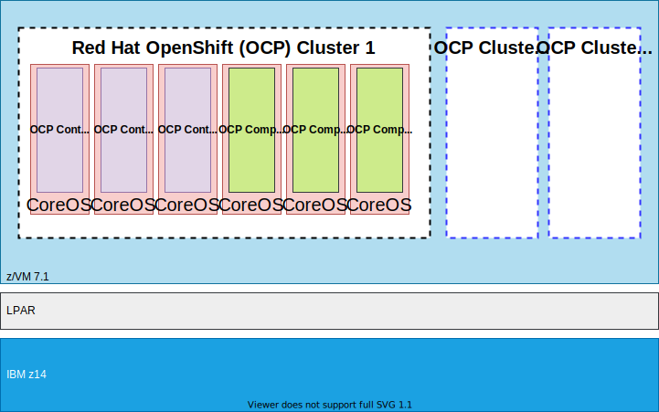

# Workshop Architecture Diagram

The OpenShift (OCP) on IBM Z environment used in this workshop is detailed in the diagram above.

Note that this *is not* the recommended OpenShift architecture for high availablity or production. For OCP on Z reference architectures [navigate to this link](https://www.ibm.com/docs/en/linux-on-systems?topic=openshift-reference-architecture).

The entire lab environment is behind the Washington Systems Center VPN. You are given a RHEL virtual machine with the Cisco VPN client installed and running which provides access to the WSC environment.

There are 4 OpenShift clusters sharing running on this z14 sharing z/VM, IFLs, and other underlying infrastructure.

Each OCP cluster is made up of 3 Control Planes and 3 Compute Nodes as shown in OCP Cluster 1 in the diagram. The Control Planes and Compute Nodes have a minimum of the resources shown for OCP cluster 1, although some clusters have more than the resources listed because of some more intensive applications running on them (Instana, Red Hat Advanced Cluster Security, Red Hat Quay, etc).

All clusters are running on a z/VM 7.3 SSI cluster on a single LPAR of an IBM z16 (again, not recommended outside of POC/demo).

There are various other support servers running as Linux guests that you use during these labs. These are outside of the OCP cluster itself, but take care of tasks such as LDAP, NFS storage, and a server with the `oc` command line [installed](https://docs.openshift.com/container-platform/4.16/cli_reference/openshift_cli/getting-started-cli.html) that will let you connect to the various OpenShift clusters.
